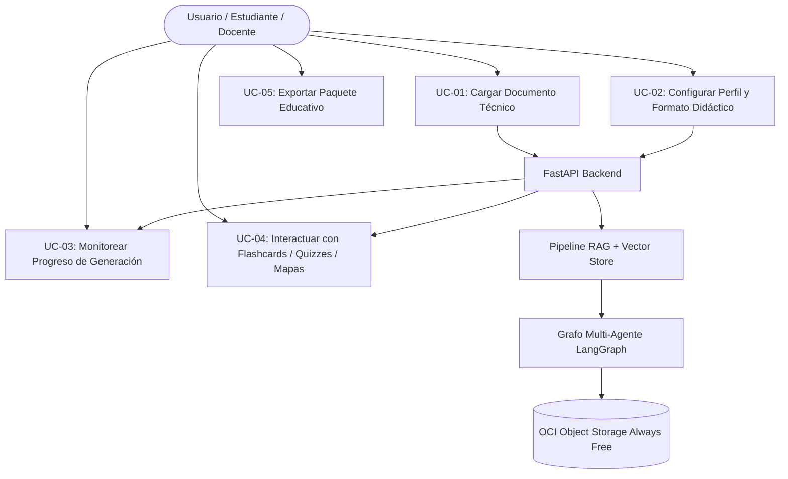

# PRODUCT REQUIREMENTS DOCUMENT (PRD)
## Proyecto: NuevaMente — Sistema Inteligente de Adaptación y Generación de Contenido Educativo
**Programa:** Hackathon ONE (Oracle Next Education) & Alura Latam — Cohorte G-10  
**Versión del Documento:** 2.0 (Especificación Formal para Fase de Desarrollo)  
**Marco de Calidad:** ISO/IEC 25010 (Software Product Quality)  
**Carácter:** Documento Formal de Requisitos de Producto y Arquitectura  

---

## 1. Visión del Producto y Justificación de Negocio

### 1.1 Declaración de la Visión
**NuevaMente** es una plataforma de software orientada a la democratización del conocimiento técnico, diseñada para transformar especificaciones complejas, manuales de arquitectura y documentación técnica densa en paquetes educativos personalizados, interactivos y con anclaje fáctico garantizado, adaptados en tiempo real según el perfil cognoscitivo de la audiencia y el formato didáctico seleccionado.

### 1.2 Problema Central
El proceso tradicional de diseño instruccional y adaptación de materiales técnicos presenta tres barreras críticas:
1. **Ineficiencia Temporal:** La adaptación manual de un manual de 50 páginas a múltiples audiencias requiere entre 30 y 45 horas de especialistas técnicos y diseñadores pedagógicos.
2. **Brecha de Comprensión por Audiencias:** Un mismo manual de infraestructura en la nube o ciberseguridad requiere abstracciones radicalmente distintas para un estudiante en transición de carrera, un desarrollador junior, un arquitecto de software o un directivo comercial.
3. **Riesgo de Alucinación:** Los modelos de lenguaje tradicionales sin verificación formal de anclaje inventan parámetros o deforman conceptos técnicos críticos, inhabilitando su uso en educación formal.

### 1.3 Propuesta de Valor y Ventajas Competitivas
* **Reducción de Tiempo:** Transformación integral en menos de 30 segundos.
* **Garantía Anti-Alucinaciones:** Métrica determinista de anclaje (`anclaje_fuente_score` $\ge 0.85$) supervisada por un agente crítico en LangGraph.
* **Generación Multimodal e Interactiva:** Flashcards interactivas, quizzes con argumentación técnica, mapas mentales jerárquicos y guías paso a paso.
* **Persistencia Empresarial a Costo Cero:** Integración activa y obligatoria con **OCI Object Storage Always Free** de Oracle Cloud.

---

## 2. Personas y Perfiles de Audiencia (Target Personas)

| Perfil | Nivel Técnico | Objetivo de Aprendizaje | Estilo de Comunicación y Adaptación |
|---|---|---|---|
| **Junior (Desarrollador Junior)** | Inicial a Intermedio | Comprender conceptos esenciales e implementar soluciones prácticas sin intimidación técnica. | Uso de analogías del mundo real, explicaciones didácticas guiadas, snippets de código/configuración comentados y desmitificación de jerga. |
| **Senior (Líder Técnico / Arquitecto)** | Avanzado | Evaluar trade-offs, seguridad, escalabilidad, resiliencia y patrones de diseño de sistemas. | Enfoque analítico riguroso, justificaciones arquitectónicas profundas, consideraciones de rendimiento y vectores de riesgo. |
| **Ejecutivo (Gestor / Perfil de Negocio)** | Estratégico | Evaluar viabilidad comercial, ROI, disponibilidad de servicio, gobernanza y cumplimiento normativo. | Resúmenes ejecutivos (TL;DR), impacto en el negocio, métricas clave y diagramas conceptuales de alto nivel orientados a toma de decisiones. |

---

## 3. Requisitos Funcionales (Functional Requirements - FR)

### FR-01: Ingesta y Procesamiento de Documentación Técnica
* **FR-01.1:** El sistema debe permitir la carga de archivos en formatos PDF (`.pdf`), Markdown (`.md`) y texto sin formato (`.txt`) con un tamaño de hasta 15 MB.
* **FR-01.2:** El extractor debe limpiar metadatos irrelevantes y preservar la estructura jerárquica de secciones, tablas y bloques de código.
* **FR-01.3:** El segmentador de texto (*Chunking*) debe procesar el documento con solapamiento (*overlap*) controlado para mantener la coherencia contextual.

### FR-02: Pipeline de RAG y Búsqueda Vectorial
* **FR-02.1:** El sistema debe vectorizar los fragmentos utilizando embeddings normalizados y almacenarlos en una base de datos vectorial local (ChromaDB / FAISS).
* **FR-02.2:** La recuperación (*retrieval*) debe filtrar por similitud semántica de coseno, recuperando los $k$ fragmentos más relevantes ($\text{similitud} \ge 0.75$).

### FR-03: Motor Multi-Agente con LangGraph y Formatos Didácticos
El orquestador debe generar los siguientes formatos de salida especializados:
* **FR-03.1 (Tarjetas Interactivas / Flashcards):** Generación de pares concepto-definición estructurados con `frente`, `dorso`, `pista_didactica` y nivel de dificultad.
* **FR-03.2 (Quizzes Interactivos con Justificación):** Preguntas de opción múltiple (4 alternativas), con identificación de la respuesta correcta, justificación técnica del porqué y explicación de por qué las alternativas incorrectas son inválidas.
* **FR-03.3 (Mapas Mentales Jerárquicos):** Generación de árboles de conocimiento estructurados (Nodo Raíz $\rightarrow$ Ramas Temáticas $\rightarrow$ Subnodos Conceptuales) exportables tanto en estructura JSON jerárquica como en sintaxis formal **Mermaid.js** (`mindmap` / `graph TD`) para su renderizado gráfico dinámico.
* **FR-03.4 (Guías Paso a Paso / Tutoriales):** Procedimientos técnicos numerados con prerrequisitos, instrucciones detalladas, snippets y validaciones de éxito.
* **FR-03.5 (Resúmenes Ejecutivos / TL;DR):** Síntesis de alto nivel estructurada en puntos clave, beneficios operativos y recomendaciones de implementación.

### FR-04: Telemetría y Stepper de Estado en Tiempo Real
* **FR-04.1:** Durante la ejecución del pipeline, el sistema debe emitir eventos de progreso en tiempo real para mantener informado al usuario en la interfaz.
* **FR-04.2:** El flujo de estados debe incluir:
  1. `1/5 - EXTRACCION`: Extrayendo y limpiando contenido del documento.
  2. `2/5 - INDEXACION`: Segmentando texto y generando base de conocimiento vectorial.
  3. `3/5 - GENERACION`: LangGraph redactando contenido adaptado según perfil y formato.
  4. `4/5 - AUDITORIA`: Agente crítico validando fidelidad fáctica y anti-alucinaciones.
  5. `5/5 - PERSISTENCIA`: Guardando documento original y paquete educativo en OCI Object Storage.
  6. `COMPLETADO`: Paquete educativo listo para render interactivo.

### FR-05: Verificación de Calidad y Anti-Alucinación (Agente Crítico)
* **FR-05.1:** El nodo crítico de LangGraph debe contrastar cada afirmación didáctica contra los fragmentos de origen y calcular el `anclaje_fuente_score`.
* **FR-05.2:** Si `anclaje_fuente_score < 0.85`, se activa un ciclo de auto-corrección que reescribe los enunciados no fundamentados antes de emitir la respuesta.
* **FR-05.3 (Criterio de Convergencia y Terminación):** El bucle de auto-corrección tiene un límite estricto de máximo 2 reintentos ($\text{iteraciones} \le 2$). Si tras 2 ciclos el umbral no se alcanza, el sistema no colapsa ni entra en bucle infinito: emite la salida acotada, registra las discrepancias en el campo `observaciones` de `evaluacion_calidad` y garantiza respuesta en tiempo acotado ($O(1)$) conforme a la norma ISO/IEC 25010 (Fiabilidad).

### FR-06: Persistencia en la Nube (Oracle Cloud Infrastructure - Always Free)
* **FR-06.1:** El sistema debe cargar el documento técnico original en el bucket Always Free de OCI Object Storage (`/documentos-fuente/`).
* **FR-06.2:** El sistema debe persistir el JSON estructurado final en el bucket (`/artefactos-generados/`).
* **FR-06.3:** La respuesta de la API debe incluir el identificador de objeto en OCI, nombre del bucket y estado de confirmación de subida.

---

## 4. Requisitos No Funcionales (Non-Functional Requirements - NFR)

Alineados al estándar internacional **ISO/IEC 25010**:

| Código | Dimensión ISO 25010 | Requisito No Funcional | Métrica de Aceptación |
|---|---|---|---|
| **NFR-01** | **Eficiencia de Desempeño** | Tiempo de procesamiento completo para documentos estándar ($\le 20$ páginas). | $\le 25\text{ segundos}$ en inferencia completa. |
| **NFR-02** | **Fiabilidad y Fidelidad** | Ausencia de invención fáctica de especificaciones o comandos. | `anclaje_fuente_score` $\ge 0.85$ y tasa de alucinación $< 2.5\%$. |
| **NFR-03** | **Seguridad** | Aislamiento absoluto de credenciales de OCI y llaves de LLM. | Cero secretos en repositorios; exclusión certificada en `.gitignore`. |
| **NFR-04** | **Usabilidad** | Interfaz reactiva con visualización clara de tarjetas, mapas y quizzes. | Tasa de éxito en tareas de usuario $> 95\%$ sin requerir manual. |
| **NFR-05** | **Compatibilidad** | Contratos de comunicación desacoplados entre frontend y backend. | OpenAPI 3.1 tipado deterministamente con Pydantic V2. |
| **NFR-06** | **Viabilidad Financiera** | Cero costo operativo en infraestructura. | $\$0.00\text{ USD}$ acumulado; restricción 100% a OCI Always Free. |

---

## 5. Casos de Uso del Sistema (Use Cases)

### Detalle de Casos de Uso:
* **UC-01 (Carga Documental):** El usuario arrastra un PDF a la zona de carga; el sistema valida extensión, tamaño y legibilidad.
* **UC-02 (Parametrización):** El usuario selecciona: Perfil = "Junior", Formato = "Mapas Mentales", Nicho = "General".
* **UC-03 (Monitoreo):** El usuario observa el stepper de 5 fases cambiando de estado en tiempo real con descripciones claras.
* **UC-04 (Interacción Didáctica):**
  - Si seleccionó **Flashcards**: Voltea tarjetas 3D, pide pistas y avanza con atajos de teclado.
  - Si seleccionó **Quiz**: Elige una opción y recibe retroalimentación inmediata sobre acierto o error con su base teórica.
  - Si seleccionó **Mapa Mental**: Visualiza un diagrama gráfico navegable con zoom/pan y nodos colapsables.
* **UC-05 (Persistencia y Exportación):** El sistema muestra la confirmación de subida a OCI Object Storage y permite descargar el paquete en Markdown o JSON.
