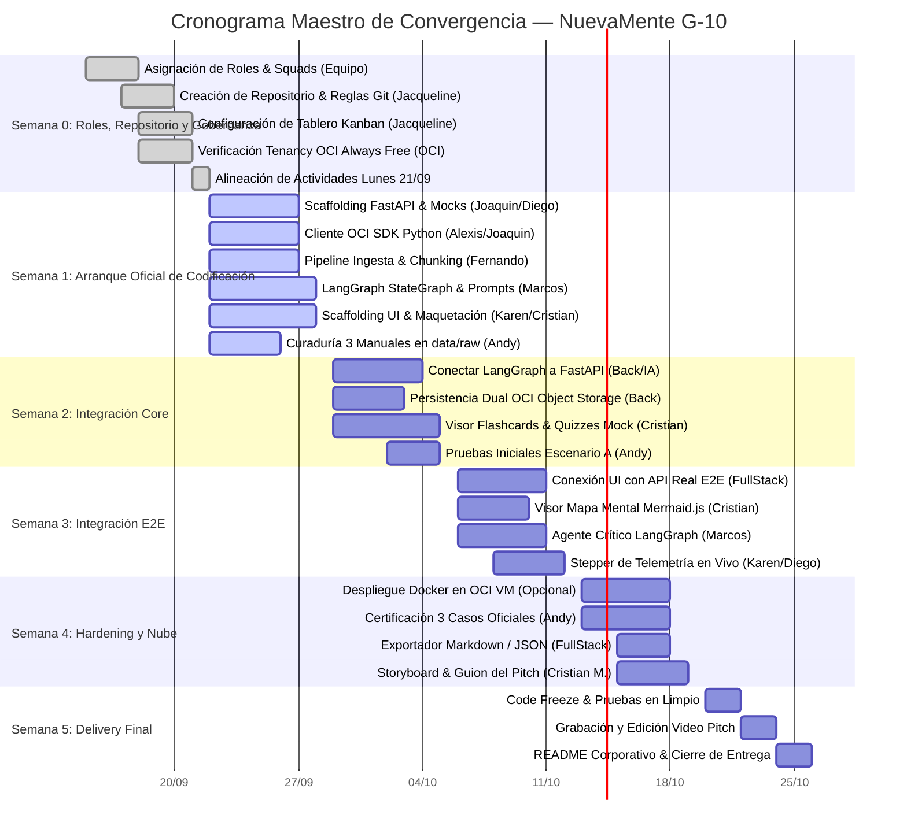

# CRONOGRAMA EXTENDIDO, HITOS Y PLAN DE CONVERGENCIA
## Proyecto: NuevaMente — Hackathon ONE (Oracle Next Education) & Alura Latam
**Horizonte:** 5 Semanas (Semana 0 a Semana 5)  
**Metodología:** Sprints Ágiles Semanales con Definition of Done (DoD) y Puntos de Control Intermedios

---

## 1. Diagrama de Gantt Maestro de Convergencia

---

### Semana 1: Arranque Oficial de Codificación y Desarrollo de Módulos Nucleares
* **Día 8 - 10 (Scaffolding e Inicialización de Código):**
  - *Backend:* Diego Mendez y Cristian Cortes crean el scaffolding del proyecto FastAPI, estructuran carpetas y publican el primer endpoint mock `POST /api/v1/adaptar-contenido` para desbloquear a Frontend.
  - *OCI:* Alexis Perez y Joaquín Rojas Yaccuzzi implementan el módulo inicial `oci_service.py` con el SDK de OCI en Python para subida y descarga al Bucket Always Free.
  - *Data Eng & QA:* Fernando Falla programa el pipeline de extracción de texto con `pymupdf` y el segmentador de chunking contextual (800/150). Andy Mijail recopila y limpia los 3 manuales oficiales en `data/raw/`.
* **Día 11 - 14 (Desarrollo Concurrente y Mocks):**
  - *Frontend:* Karen Macarena González y Cristian Cortes inicializan la aplicación web, maquetan la zona de carga (Drag & Drop) y selectores consumiendo el endpoint mock de FastAPI.
  - *IA:* Marcos Gael construye el `StateGraph` inicial en LangGraph conectando nodos de enrutamiento y redacción pedagógica básica con tipado Pydantic V2.
* **Hito de Control 1 (M-1):** Proyectos base creados en el repositorio. Frontend renderiza exitosamente los datos devueltos por el backend mock y módulo de ingesta vectorial operativo de forma aislada.

---

### Semana 2: Integración IA + Backend + OCI (Núcleo Funcional)
* **Día 15 - 17:**
  - *Backend & IA:* Diego Mendez, Alexis Perez y Marcos Gael conectan el controlador de FastAPI con la invocación directa al grafo de LangGraph.
  - *Data Eng:* Fernando Falla conecta el recuperador vectorial ChromaDB con el nodo de contexto de LangGraph.
* **Día 18 - 21:**
  - *Backend & OCI:* Diego Mendez, Alexis Perez y Joaquín Rojas Yaccuzzi integran la persistencia dual: subida del archivo fuente original y del paquete JSON generado al bucket `nuevamente-contenidos-educativos`.
  - *Frontend:* Karen Gonzalez y Cristian Cortes programan la animación de volteo 3D de las Flashcards y la interacción de selección en Quizzes sobre los datos del backend.
  - *QA & IA:* Andy Mijail ejecuta la primera prueba funcional de punta a punta con el Manual de Redes VCN en OCI en su turno matutino.
* **Hito de Control 2 (M-2):** El pipeline backend procesa un documento real desde la terminal, genera el contenido pedagógico y lo almacena de forma verificable en OCI Object Storage.

---

### Semana 3: Integración de Punta a Punta (E2E), Mapas Mentales y Telemetría
* **Día 22 - 24:**
  - *Full Stack:* Conexión de la interfaz gráfica a la API real de FastAPI. Sustitución total de los mocks.
  - *IA:* Implementación de la generación de sintaxis Mermaid para Mapas Mentales jerárquicos y calibración del nodo crítico de anclaje.
* **Día 25 - 28:**
  - *Frontend:* Integración del renderizador Mermaid.js para mapas mentales con controles de zoom/pan.
  - *Telemetría:* Activación del Stepper de progreso en tiempo real mostrando las 5 fases en la interfaz.
  - *QA:* Andy realiza auditoría formal de anti-alucinaciones en los 3 manuales oficiales.
* **Hito de Control 3 (M-3):** Aplicación 100% interactiva y funcional. Un usuario puede subir un PDF, ver el progreso en vivo y estudiar con Flashcards, Quizzes o Mapas Mentales.

---

### Semana 4: Despliegue en Nube con Docker, Certificación de Casos y Guion
* **Día 29 - 31:**
  - *OCI & Backend (Opcional Diferencial):* Alexis Perez y Joaquín Rojas Yaccuzzi configuran una instancia Linux Always Free en OCI Compute, empaquetan la solución con `docker-compose.yml` y verifican acceso público seguro.
  - *QA & IA:* Andy y Marcos ejecutan y registran los 3 escenarios obligatorios (Redes VCN para Junior, Machine Learning para Senior, Gobernanza para Ejecutivo).
* **Día 32 - 35:**
  - *Full Stack:* Implementación de botones de descarga (JSON, Markdown y SVG de mapa mental).
  - *Comms & Gestión:* Cristian Maida redacta el guion segundo a segundo del Video Pitch y Jacqueline coordina la revisión final de tareas en el tablero Kanban.
* **Hito de Control 4 (M-4):** Los 3 casos de prueba oficiales certificados y documentados. Demostración funcional lista para grabación.

---

### Semana 5: Code Freeze, Producción de Pitch y Entrega Formal
* **Día 36 - 37 (Code Freeze):**
  - Cierre definitivo de ramas en Git. Fusión final de `develop` hacia `main` tras validación de Jacqueline.
  - Prueba de instalación limpia desde cero en una máquina ajena siguiendo el `README.md`.
* **Día 38 - 39 (Producción del Video Pitch):**
  - Grabación de la interfaz interactiva, navegación de flashcards, resolución de quiz, mapa mental y verificación en la consola de Oracle Cloud.
  - Edición del video con voz clara en off, subtítulos y duración exacta entre 3 y 4 minutos.
* **Día 40 - 41 (Revisión de Cumplimiento):**
  - Andy y Jacqueline verifican el cumplimiento del 100% de los criterios del checklist oficial de Alura/Oracle.
  - Cristian Maida publica el video en YouTube (modo no listado) o Loom y verifica el README final.
* **Día 42 (Entrega y Cierre):**
  - Registro de los enlaces de entrega en la plataforma del Hackathon ONE.
  - Cierre formal de actividades y entrega completada con éxito.
