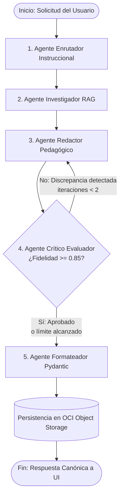
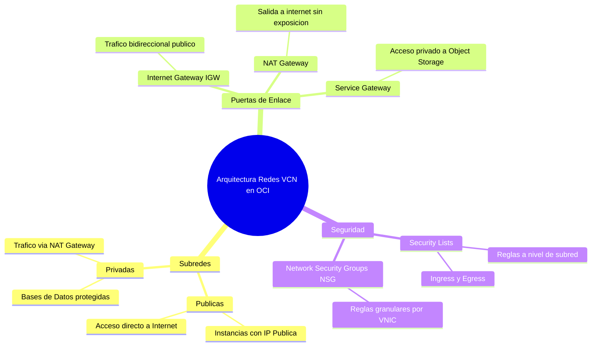

# ESPECIFICACIÓN TÉCNICA DE ARQUITECTURA DE IA, PIPELINE RAG Y SISTEMA MULTI-AGENTE
## Proyecto: NuevaMente — Plataforma Educativa Inteligente
**Squad Responsable:** Inteligencia Artificial (Fernando Falla, Marcos Gael, Andy Mijail)  
**Propósito:** Definir en profundidad técnica las tecnologías, bibliotecas, algoritmos de chunking, modelos de embeddings, LLMs (nube y locales) y la arquitectura multi-agente con LangGraph.

---

## 1. Pipeline de Ingesta y Extracción Documental (Fernando Falla)

### 1.1 Comparativa de Bibliotecas de Extracción de PDF
La documentación técnica de Oracle, nubes públicas y software contiene estructuras complejas: texto jerarquizado, tablas de parámetros de red, bloques de comandos y fragmentos de código.

| Biblioteca | Velocidad | Preservación de Jerarquía / Tablas | Complejidad de Instalación | Decisión de Selección |
|---|:---:|:---:|:---:|---|
| **PyPDF (`pypdf`)** | Media | Básica (a veces mezcla columnas) | Ligera (Python puro) | **Librería Baseline Oficial** (recomendada en las bases de Oracle ONE). |
| **PyMuPDF (`fitz`)** | **Extrema (10x)** | **Alta (detecta bloques y posiciones)** | Ligera (binarios precompilados) | **Recomendada como motor primario** por su precisión y rendimiento. |
| **PDFPlumber** | Lenta | Excelente en tablas | Requiere dependencias pesadas | Opcional para extracción precisa de tablas complejas. |

### 1.2 Estrategia de Extracción Unificada
Se implementa una clase base `DocumentExtractor` con soporte polimórfico:
1. **Archivos `.pdf`:** Extracción por páginas con preservación de números de página y delimitación de encabezados.
2. **Archivos `.md` (Markdown):** Lectura nativa respetando la jerarquía sintáctica de títulos (`#`, `##`, `###`), tablas y bloques de código con triple comilla invertida (` ``` `).
3. **Archivos `.txt`:** Decodificación segura en `utf-8` con limpieza de caracteres de control nulos.

---

## 2. Estrategia de Segmentación Contextual (Chunking)

Un error común en RAG es el chunking ciego por longitud de caracteres, el cual corta conceptos a mitad de una explicación o fragmenta una tabla de puertos de red.

```
┌─────────────────────────────────────────────────────────────────────────────┐
│                    ARQUITECTURA DE CHUNKING CONTEXTUAL                      │
├─────────────────────────────────────────────────────────────────────────────┤
│  Documento Original (PDF / MD)                                              │
│  │                                                                          │
│  ▼                                                                          │
│  RecursiveCharacterTextSplitter (Especializado en Documentación Técnica)     │
│  • Separadores Jerárquicos: ["\n## ", "\n### ", "\n```", "\n\n", "\n", " "] │
│  • Chunk Size: 800 tokens (~3,200 caracteres)                               │
│  • Chunk Overlap: 150 tokens (~600 caracteres)                             │
│  │                                                                          │
│  ▼                                                                          │
│  Inyección de Metadatos de Cabecera en cada Fragmento:                      │
│  "[Documento: manual-vcn.pdf | Sección: Redes Virtuales | Pág: 4] + Texto"   │
└─────────────────────────────────────────────────────────────────────────────┘
```

### 2.1 Parámetros Técnicos de Chunking:
* **Separadores Ordenados:** `["\n## ", "\n### ", "\n#### ", "\n```", "\n\n", "\n", " "]`. Esto asegura que el divisor intente primero no romper secciones lógicas ni bloques de código antes de descender a párrafos u oraciones.
* **Tamaño del Chunk (`chunk_size = 800 tokens`):** Tamaño óptimo para capturar una definición técnica completa junto a sus propiedades o comandos de ejemplo.
* **Solapamiento (`chunk_overlap = 150 tokens`):** Margen suficiente para garantizar que los conceptos frontera entre dos fragmentos conserven su contexto semántico.
* **Enriquecimiento con Metadatos:** A cada chunk se le añade programáticamente un encabezado con el archivo de origen, el título de la sección y la página correspondiente, facilitando la citación fáctica exacta por parte del agente crítico.

---

## 3. Matriz de Decisión: Modelos de Embeddings y Vector Store

### 3.1 Modelos de Embeddings (Nube vs Local)

| Modelo / Proveedor | Tipo | Dimensiones | Ventajas | Consideraciones |
|---|:---:|:---:|---|---|
| **Google Gemini `text-embedding-004`** | Nube | **768** | **Modelo de referencia de Oracle ONE**; excelente comprensión en español; capa gratuita de alta cuota (Google AI Studio). | Requiere conexión a internet y `GEMINI_API_KEY`. |
| **FastEmbed (`BAAI/bge-small-en-v1.5` o `all-MiniLM-L6-v2`)** | Local | **384** | **100% offline, coste $0.00**, ejecuta en CPU local en $< 20\text{ms}$ usando ONNX Runtime sin requerir GPUs. | Vocabulario en inglés optimizado, menor capacidad en textos densos en español. |
| **OpenAI `text-embedding-3-small`** | Nube | **1536** | Máxima precisión de similitud semántica. | Requiere cuenta de pago activa en OpenAI. |

> **Directriz de Selección para el Equipo:**  
> Se adopta **Google Gemini `text-embedding-004` como modelo primario** (100% alineado al programa Oracle ONE). Se implementa una interfaz `EmbeddingsProvider` con respaldo en `fastembed` para permitir pruebas locales continuas en caso de intermitencia de conexión.

### 3.2 Base de Datos Vectorial (Vector Store)
* **Elección Oficial:** **ChromaDB** (modo en memoria o persistencia local en directorio `data/vector_store/`).
* **Justificación:** Es liviano, de código abierto, se instala como simple paquete Python (`pip install chromadb`) y permite filtrado semántico por metadatos (e.g. filtrar por sección o documento) sin requerir un clúster de base de datos externo.
* **Métrica de Similitud:** Similitud de Coseno con umbral de filtrado $k=5$ y umbral de relevancia $\ge 0.75$.

---

## 4. Modelos de Lenguaje (LLMs): Nube vs Modelos Locales

El sistema implementa una arquitectura desacoplada mediante la abstracción `BaseChatModel` de LangChain, permitiendo alternar entre proveedores mediante variables de entorno:

### 4.1 Proveedores en la Nube (Recomendados para el Hackathon)
1. **Google Gemini 1.5 Flash (Modelo Principal de Competencia):**
   * *Ventajas:* Soporte nativo para Structured Outputs de Pydantic, ventana de contexto de 1 millón de tokens, latencia ultra-rápida ($< 2\text{s}$ por nodo), gratuita en Google AI Studio dentro de los límites de rate limit.
   * *Alineación:* Es la tecnología oficial del currículo de Inteligencia Artificial de Oracle ONE.
2. **OpenAI GPT-4o-mini (Alternativa Cloud):**
   * *Ventajas:* Rigor excepcional en seguimiento de esquemas JSON complejos.
3. **Groq (`llama-3.3-70b-versatile` / `mixtral-8x7b`):**
   * *Ventajas:* Inferencia a velocidades de más de 300 tokens/segundo, ideal para demostraciones en vivo sin demoras.

### 4.2 Soporte para Modelos Locales (Vía Ollama)
Para entornos donde se prefiera o requiera ejecución 100% soberana o local:
* **Ollama con `qwen2.5:7b` o `llama3.1:8b`:**
  * Ambos modelos soportan modo JSON estructurado y operan eficientemente en máquinas con 16 GB de RAM o GPU Nvidia de consumo.
  * *Nous Hermes 3 (Llama-3.1-8B):* Excelente para razonamiento agéntico, seguir instrucciones complejas de crítica y análisis de discrepancias.

---

## 5. Arquitectura Detallada del Sistema Multi-Agente (LangGraph)

El sistema opera como un grafo de decisión con **5 agentes especializados** que interactúan sobre un estado compartido tipado:



---

### 5.1 Estado Compartido del Grafo (`AgentState`)

```python
from typing import TypedDict, List, Dict, Any, Optional

class AgentState(TypedDict):
    # Parámetros de entrada
    documento_titulo: str
    documento_texto_completo: str
    perfil_destinatario: str
    formato_salida: str
    nicho_sector: str
    nivel_detalle: str
    
    # Contexto recuperado por RAG
    fragmentos_recuperados: List[Dict[str, Any]]
    
    # Salida preliminar del redactor
    contenido_borrador: Dict[str, Any]
    
    # Evaluación del crítico
    anclaje_fuente_score: float
    observaciones_criticas: str
    iteraciones_autocorreccion: int
    aprobado_por_critico: bool
    
    # Salida canónica final
    paquete_final_json: Dict[str, Any]
    oci_metadatos: Dict[str, Any]
```

---

### 5.2 Especificación y Prompting de los 5 Agentes

#### Agente 1: Enrutador Instruccional (`RouterAgent`)
* **Responsabilidad:** Analizar la tupla `(perfil_destinatario, formato_salida, nicho_sector)` y configurar la estrategia de contextualización.
* **Lógica Interna:** Si el perfil es "Junior", configura directrices de analogías pedagógicas, conceptos fundamentales y prohibición de acrónimos sin explicar. Si es "Senior", activa directrices de análisis de trade-offs, seguridad y escalabilidad. Si es "Ejecutivo", activa directrices de impacto en negocio, ROI, métricas y síntesis estratégica de alto nivel.

#### Agente 2: Investigador RAG (`RetrievalAgent`)
* **Responsabilidad:** Formular consultas semánticas dirigidas a ChromaDB basadas en el perfil y formato.
* **Lógica Interna:** No hace una búsqueda genérica del texto completo; formula 3 sub-consultas semánticas específicas para recuperar conceptos clave, reglas de arquitectura y ejemplos fácticos, consolidando los top 5 chunks.

#### Agente 3: Redactor Pedagógico (`PedagogicalDraftingAgent`)
* **Responsabilidad:** Redactar el contenido didáctico según el formato solicitado utilizando *Few-Shot Prompting*.
* **Casos Especializados:**
  - **Flashcards:** Genera frente conciso, dorso didáctico y pista analógica.
  - **Quizzes:** Diseña la pregunta, 4 alternativas plausibles, identifica el índice correcto y argumenta por qué las otras 3 son incorrectas.
  - **Mapas Mentales:** Produce el árbol jerárquico y escribe el bloque formal de **Mermaid.js** (`mindmap`).
  - **Tutoriales:** Escribe instrucciones paso a paso con comandos y salidas esperadas.

#### Agente 4: Crítico Evaluador Anti-Alucinaciones (`QualityCriticAgent`)
* **Responsabilidad:** Auditar de forma implacable el borrador generado contra los fragmentos de origen recuperados por el RAG.
* **Prompt del Crítico:**
  ```text
  Eres un auditor técnico riguroso. Tu único objetivo es certificar que CADA afirmación,
  número, comando y concepto en el contenido generado esté estrictamente sustentado en
  los fragmentos de contexto proporcionados.
  
  Calcula el anclaje_fuente_score de 0.0 a 1.0:
  Score = (Afirmaciones Fácticas Justificadas en el Contexto) / (Total de Afirmaciones)
  
  Si detectas conceptos inventados o no presentes en las fuentes:
  - Marca aprobado = False
  - Lista exactamente las afirmaciones no sustentadas para que el redactor las elimine o corrija.
  ```
* **Límite de Salvaguarda:** Si el contador de reintentos alcanza `iteraciones == 2`, el crítico marca `aprobado = True` anotando en las observaciones: *"Salida emitida bajo límite de iteraciones con anclaje de X.XX"*, garantizando terminación determinista.

#### Agente 5: Formateador y Sanitizador Pydantic (`OutputFormattingAgent`)
* **Responsabilidad:** Convertir el diccionario validado en una instancia formal del modelo `AdaptacionContenidoResponse` de Pydantic V2.
* **Manejo de Excepciones:** Si un campo opcional no fue generado, asigna los valores por defecto canónicos (`status = "exito"`, `status_upload = "completado"`).

---

## 6. Generación Determinista de Mapas Mentales en Mermaid.js

Para la funcionalidad de Mapas Mentales, el `PedagogicalDraftingAgent` genera una estructura jerárquica que compila directamente a sintaxis Mermaid:

### Ejemplo de Salida Generada por el Agente:


Esta sintaxis es interpretada en milisegundos por el Frontend mediante la biblioteca `mermaid.js`, permitiendo al estudiante explorar visualmente los componentes antes de profundizar en flashcards o quizzes.

---

## 7. Plan de Implementación para el Squad de IA

1. **Paso 1 (Fernando Falla):** Crear `src/ai/ingestion/extractors.py` con soporte PyMuPDF / PyPDF y `src/ai/ingestion/text_splitter.py` con la lista de separadores jerárquicos.
2. **Paso 2 (Fernando Falla):** Crear `src/ai/embeddings/vector_manager.py` para instanciar ChromaDB y Google Gemini Embeddings.
3. **Paso 3 (Marcos Gael):** Crear `src/ai/prompts/` con los templates de los 4 perfiles y los 5 formatos didácticos.
4. **Paso 4 (Marcos Gael):** Construir el `StateGraph` en `src/ai/agents/graph.py` ensamblando los nodos `router`, `retriever`, `drafting`, `critic` y `formatter`.
5. **Paso 5 (Andy Mijail):** Crear un banco de pruebas en `tests/ai/test_anclaje.py` validando que las ejecuciones sobre los 3 manuales oficiales arrojen un score de anclaje $\ge 0.85$.
