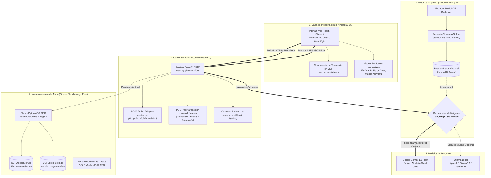
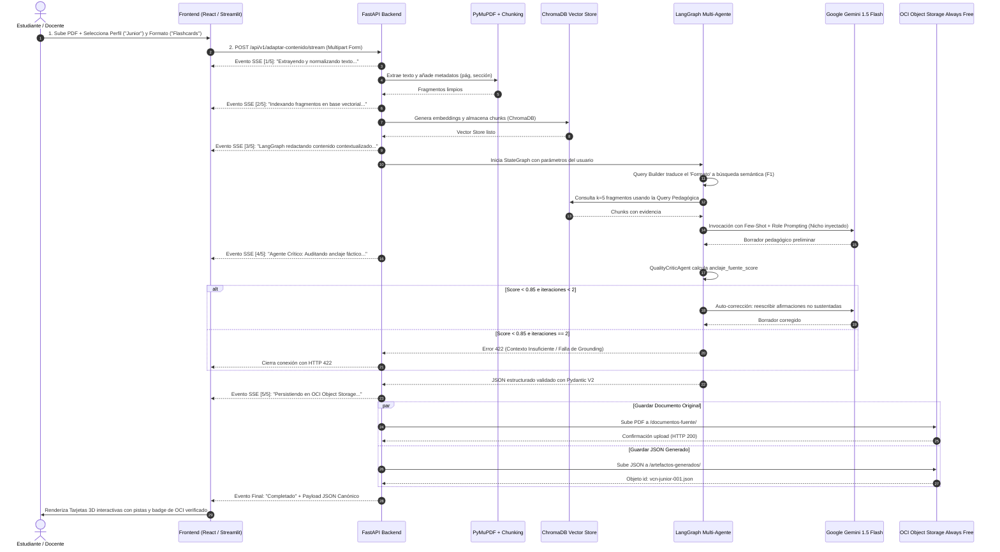
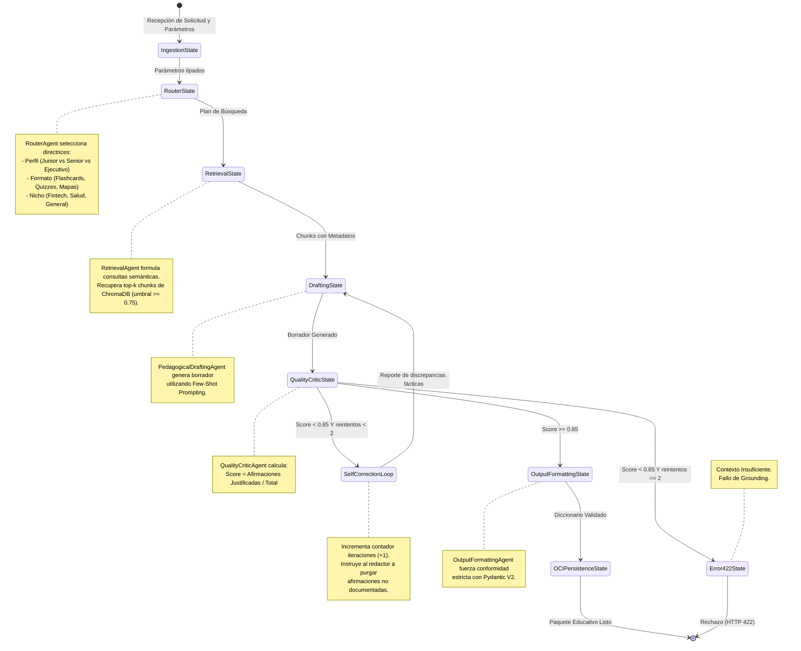
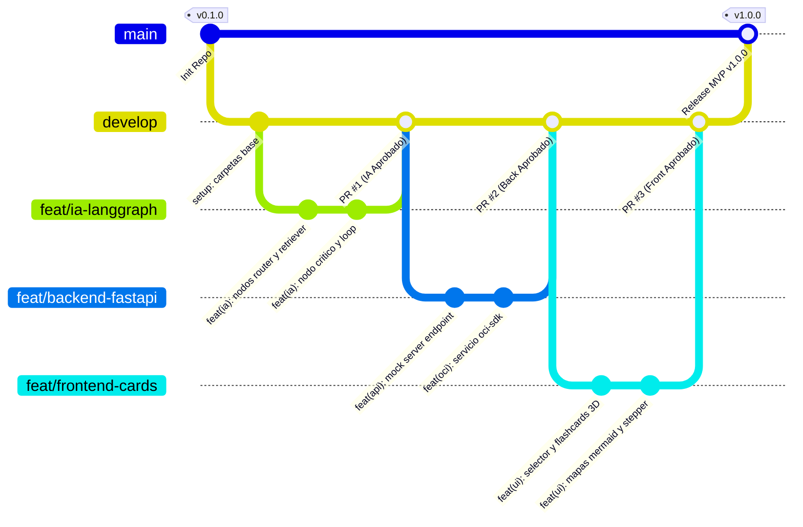

# DIAGRAMAS VISUALES DE ARQUITECTURA, FLUJOS Y TRABAJO COLABORATIVO
## Proyecto: NuevaMente — Plataforma Educativa Inteligente
**Propósito:** Proporcionar una representación visual, esquemática y formal de la arquitectura integral, las dependencias entre los 4 squads, la secuencia de ejecución de extremo a extremo (E2E) y la máquina de estados de LangGraph.

---

## 1. Arquitectura General del Sistema (Modelo C4 - Nivel de Contenedores)

Este diagrama representa cómo se comunican las cuatro capas del sistema: el cliente de usuario, la API backend, el motor de Inteligencia Artificial y los servicios en la nube de Oracle.



---

## 2. Flujo de Colaboración Operativa entre los 4 Squads (Handshake Matrix)

Este diagrama clarifica exactamente qué genera cada squad y qué entrega al siguiente para garantizar que los 11 integrantes trabajen en sincronía y sin bloqueos:

```mermaid
flowchart LR
    subgraph S1["🟢 GESTIÓN Y DELIVERY"]
        JAC["Jacqueline Rioja (PM)<br>• Reglas Git main protegida<br>• Tablero Kanban<br>• Dailies"]
        MAIDA["Cristian Maida (Comms)<br>• README y C4<br>• Guion del Pitch<br>• Video Demo"]
    end

    subgraph S2["🔵 INTELIGENCIA ARTIFICIAL"]
        FER["Fernando Falla (Data)<br>• Extracción PyMuPDF<br>• Chunking 800/150<br>• ChromaDB"]
        MARCOS["Marcos Gael (AI Eng)<br>• LangGraph StateGraph<br>• Prompts 3 perfiles<br>• Agente Crítico"]
        ANDY["Andy Mijail (QA)<br>• 3 Manuales reales<br>• Matriz de Casos A,B,C<br>• Auditoría anclaje"]
    end

    subgraph S3["🟠 BACKEND Y OCI"]
        OCI_T["Alexis & Joaquin (OCI)<br>• Bucket Always Free<br>• oci_service.py<br>• Alarma $0.01"]
        BACK["Diego & Cristian C. (Back)<br>• FastAPI /adaptar-contenido<br>• Mock Server (Sem 1)<br>• Integración LangGraph"]
    end

    subgraph S4["🟣 FRONTEND Y UX"]
        KAREN["Karen Gonzalez (Front)<br>• UI Minimalista<br>• Drag & Drop PDF<br>• Stepper Telemetría"]
        CORTES["Cristian Cortes (FullStack)<br>• Tarjetas Flashcards 3D<br>• Quizzes con Feedback<br>• Mapas Mermaid.js"]
    end

    JAC -.->|Gobernanza y Sprints| S2
    JAC -.->|Gobernanza y Sprints| S3
    JAC -.->|Gobernanza y Sprints| S4

    FER -->|Vector Store + Contexto| MARCOS
    MARCOS -->|Borrador JSON| ANDY
    ANDY -->|Validación Fidelidad| MARCOS
    MARCOS ==>|Contrato Pydantic V2| BACK
    
    OCI_T ==>|Módulo oci_service.py| BACK
    BACK ==>|1. Mock JSON (Sem 1)<br>2. API Real (Sem 2)| CORTES
    
    KAREN -->|Maquetación UI| CORTES
    CORTES ==>|Producto Funcional E2E| MAIDA
    MAIDA -->|Video Pitch y Demo Grabada| JAC
```

---

## 3. Diagrama de Secuencia de Extremo a Extremo (E2E Execution)

Muestra la traza completa desde que un usuario sube un PDF en el navegador hasta que se renderizan las tarjetas/quizzes y se confirma el guardado en Oracle Cloud:



---

## 4. Máquina de Estados del Grafo Multi-Agente (LangGraph State Machine)

Detalla el ciclo interno de los agentes, la evaluación del anclaje y el límite matemático de reintentos para garantizar fiabilidad (ISO/IEC 25010):



---

## 5. Estrategia de Ramas Git y Pipeline de Integración Continua (CI/CD)

Muestra cómo se integran las ramas de los 11 desarrolladores de forma segura hacia la rama de producción `main`:


