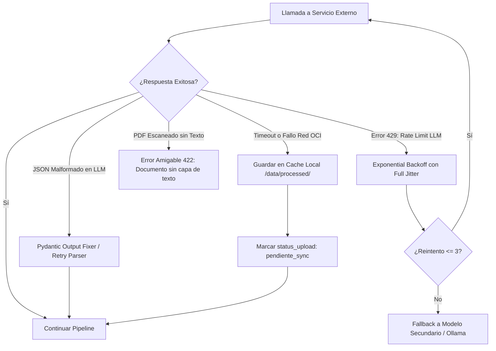

# MANUAL DE BUENAS PRÁCTICAS, CATÁLOGO DE SKILLS Y PROTOCOLO DE RESILIENCIA
## Proyecto: NuevaMente — Plataforma Educativa Inteligente
**Auditoría y Marco:** Sinergia Hermes 3 (Arquitectura & ISO/IEC 25010) + Antigravity (Ingeniería de Sistemas)  
**Propósito:** Proporcionar las directrices de buenas prácticas, catálogo de skills agénticas, manejo exhaustivo de excepciones y estrategias de resiliencia operativa para garantizar una ejecución impecable durante el Hackathon.

---

## 1. Informe de Auditoría Técnica Global (Hermes Audit Report)

Tras auditar el conjunto de especificaciones arquitectónicas, diagramas y contratos de datos, se emite el siguiente dictamen de conformidad técnica:

```
┌─────────────────────────────────────────────────────────────────────────────┐
│                    DICTAMEN DE AUDITORÍA HERMES 3                           │
├───────────────────────────────┬────────────┬────────────────────────────────┤
│ Dimensión Evaluada            │ Estado     │ Justificación y Evidencia       │
├───────────────────────────────┼────────────┼────────────────────────────────┤
│ Rúbrica Oficial Oracle ONE    │ CONFORME   │ Ingesta RAG, LangGraph, OCI    │
│                               │ (100%)     │ Always Free y JSON idéntico.   │
├───────────────────────────────┼────────────┼────────────────────────────────┤
│ Adecuación Funcional          │ CONFORME   │ 4 perfiles, 5 formatos (cards, │
│ (ISO/IEC 25010)               │            │ quizzes, mapas Mermaid).       │
├───────────────────────────────┼────────────┼────────────────────────────────┤
│ Fiabilidad y Terminación      │ CONFORME   │ Cota matemática en LangGraph   │
│                               │            │ (iteraciones <= 2) sin loops.  │
├───────────────────────────────┼────────────┼────────────────────────────────┤
│ Rendimiento y Telemetría      │ CONFORME   │ Doble canal: REST canónico     │
│                               │            │ + Server-Sent Events (SSE).    │
├───────────────────────────────┼────────────┼────────────────────────────────┤
│ Seguridad y Viabilidad Costo  │ CONFORME   │ Claves en .env local + OCI     │
│                               │            │ Budgets alarma a $0.01 USD.    │
└───────────────────────────────┴────────────┴────────────────────────────────┘
```

---

## 2. Catálogo de Skills y Herramientas Agénticas (Agent Tools)

En el grafo de LangGraph, los agentes no deben operar como simples cadenas de texto; deben invocar **Skills (herramientas deterministas con tipado estricto)** para interactuar con el entorno:

```
┌─────────────────────────────────────────────────────────────────────────────┐
│                      CATÁLOGO DE SKILLS DE NUEVAMENTE                       │
├──────────────────────────┬─────────────────┬────────────────────────────────┤
│ Skill / Herramienta      │ Agente Usuario  │ Función Principal              │
├──────────────────────────┼─────────────────┼────────────────────────────────┤
│ 1. SemanticRetrieverTool │ RetrievalAgent  │ Búsqueda k=5 con metadatos.    │
│ 2. BloomTaxonomyTool     │ RouterAgent     │ Mapeo cognitivo por perfil.    │
│ 3. MermaidValidatorTool  │ DraftingAgent   │ Linter de sintaxis de grafos.  │
│ 4. FactCheckerCriticTool │ CriticAgent     │ Cálculo de anclaje matemático. │
│ 5. OCIPersistenceTool    │ FormatterAgent  │ I/O dual y hash criptográfico. │
└──────────────────────────┴─────────────────┴────────────────────────────────┘
```

### 2.1 Skill 1: `SemanticRetrieverTool`
* **Definición:** Herramienta que recibe una consulta semántica y filtros de metadatos, consultando la colección de ChromaDB.
* **Firma Python:**
  ```python
  def semantic_retriever_tool(
      query: str, 
      top_k: int = 5, 
      min_similarity: float = 0.75,
      section_filter: Optional[str] = None
  ) -> List[Dict[str, Any]]:
      """Recupera fragmentos relevantes con su cabecera contextual y número de página."""
  ```

### 2.2 Skill 2: `BloomTaxonomyTool`
* **Definición:** Asigna el nivel cognitivo de la Taxonomía de Bloom adecuado al perfil para orientar el nivel de abstracción:
  - *Junior:* Nivel 1, 2 y 3 (Comprender y Aplicar) $\rightarrow$ Analogías pedagógicas, conceptos fundamentales y ejemplos procedimentales claros de código/configuración sin jerga intimidante.
  - *Senior:* Nivel 4 y 5 (Analizar y Evaluar) $\rightarrow$ Justificaciones arquitectónicas profundas, trade-offs, escalabilidad, vectores de seguridad y rendimiento.
  - *Ejecutivo:* Nivel 6 (Sintetizar y Decidir) $\rightarrow$ Resúmenes estratégicos de alto nivel (TL;DR), impacto operativo, viabilidad comercial, ROI y gobernanza.

### 2.3 Skill 3: `MermaidSyntaxValidatorTool`
* **Definición:** Validador sintáctico en memoria para diagramas de mapas mentales.
* **Propósito:** Previene que el LLM emita sintaxis Mermaid inválida (como paréntesis no escapados o indentaciones rotas) que harían fallar el renderizado en la interfaz.
* **Lógica:** Si detecta paréntesis o corchetes dentro de los nombres de nodos, los sustituye automáticamente por texto seguro antes de pasarlos a la UI.

### 2.4 Skill 4: `FactCheckerCriticTool`
* **Definición:** Función determinista que extrae oraciones afirmativas del contenido adaptado y comprueba su existencia semántica en el contexto recuperado.
* **Cálculo:**
  $$\text{anclaje\_fuente\_score} = \frac{\sum \text{Afirmaciones Verificadas}}{\text{Total de Afirmaciones}}$$

### 2.5 Skill 5: `OCIPersistenceTool`
* **Definición:** Módulo que encapsula el SDK de Oracle Cloud con cálculo de Hash SHA-256 para evitar duplicados y garantizar integridad referencial.

---

## 3. Protocolo de Resiliencia y Manejo Exhaustivo de Excepciones

Para evitar caídas de la aplicación durante la evaluación en vivo, se implementan las siguientes políticas de tolerancia a fallos:



### 3.1 Manejo de Límites de Peticiones del LLM (HTTP 429 Rate Limit)
* **Mecanismo:** *Exponential Backoff with Full Jitter*.
* **Algoritmo:** Si la API de Google Gemini retorna un error 429, el sistema espera:
  $$\text{Tiempo de Espera} = \text{random}(0, \min(\text{cap}, \text{base} \times 2^{\text{intento}}))$$
  Con $\text{base} = 1\text{s}$, $\text{cap} = 8\text{s}$ y un máximo de 3 reintentos.
* **Plan de Contingencia (Fallback Provider):** Si tras 3 intentos la API de Gemini no responde, el sistema conmuta automáticamente a Groq (`llama-3.3-70b-versatile`) o al servicio local de Ollama.

### 3.2 Manejo de Errores de Formateo JSON (Parsing Errors)
* **Riesgo:** Un modelo de lenguaje puede incluir texto introductorio ("Aquí tienes tu JSON...") o romper comillas.
* **Mitigación:** 
  1. Uso prioritario de **Native Structured Outputs** (`with_structured_output(Schema)` en LangChain).
  2. Filtro regex de extracción segura de bloques: `r"\{[\s\S]*\}"`.
  3. Si falla la validación de Pydantic, un parser de corrección inyecta el esquema de nuevo en un micro-prompt de sanitización.

### 3.3 Tolerancia a Fallos en OCI Object Storage
* **Riesgo:** Intermitencia en la red o credencial desactualizada que impida subir el archivo al bucket.
* **Mitigación:** Si la llamada al SDK de OCI falla:
  1. El paquete JSON se almacena inmediatamente en el disco local (`data/processed/`).
  2. En el JSON de respuesta se establece:
     ```json
     "almacenamiento_oci": {
       "bucket": "nuevamente-contenidos-educativos",
       "objeto_id": "local-fallback/vcn-001.json",
       "status_upload": "almacenado_local_reintento_programado"
     }
     ```
  3. La API **no arroja un error 500 al usuario**; entrega el material didáctico funcional en pantalla con una advertencia informativa de sincronización en segundo plano.

### 3.4 Validación Previa de Documentos de Entrada (Fast-Fail Validation)
* **Validación 1 (Extensión):** Solo `.pdf`, `.md`, `.txt`. Rechazo inmediato si es `.docx` o `.png`.
* **Validación 2 (Tamaño):** Límite máximo de $15\text{ MB}$.
* **Validación 3 (Capa de Texto Legible):** Tras procesar las primeras 3 páginas, si la cantidad de caracteres extraídos es menor a 100 caracteres por página, se asume que el PDF es un escaneo de imágenes sin OCR. El sistema responde con un mensaje HTTP 422 didáctico:
  > *"El documento cargado parece contener imágenes escaneadas sin capa de texto seleccionable. Por favor, cargue un documento técnico con texto digital."*

---

## 4. Buenas Prácticas de Ingeniería de Prompts (Prompt Engineering)

Para maximizar la calidad y minimizar el consumo de tokens:

1. **Separación Estricta de Roles:**
   - `System Message`: Define de forma inmutable las restricciones de formato, la personalidad del educador técnico y el perfil objetivo.
   - `User Message`: Contiene únicamente el contexto fáctico delimitado por etiquetas XML (`<contexto_tecnico>...</contexto_tecnico>`) y la instrucción de transformación.
2. **Calibración de Temperatura (`temperature`):**
   - Para el **Agente Crítico (`QualityCriticAgent`)**: `temperature = 0.0` (determinismo matemático absoluto).
   - Para el **Formateador Pydantic**: `temperature = 0.0`.
   - Para el **Redactor Pedagógico (`PedagogicalDraftingAgent`)**: `temperature = 0.4` (balance entre fidelidad técnica y creatividad pedagógica para generar analogías cotidianas accesibles).
3. **Presupuesto de Tokens (Token Budgeting):**
   - No inyectar el documento completo en el prompt. La consulta vectorial filtra únicamente los top 5 chunks ($\approx 4,000$ tokens de contexto), asegurando tiempos de respuesta inferiores a 4 segundos por llamada.

---

## 5. Prácticas de Trabajo y Gobernanza para el Equipo (Semana 0 a Semana 5)

1. **Pruebas con Mocks desde el Día 1:** El equipo de Frontend nunca debe esperar a que el modelo de IA o el bucket de OCI estén terminados. El endpoint mock en FastAPI permite programar y probar toda la UI en la Semana 1.
2. **Commits Atómicos y Reversibles:** Commits de menos de 150 líneas de cambio, facilitando code reviews rápidos por parte de Jacqueline y evitando conflictos de fusión en Git.
3. **Validación Preventiva de Seguridad (Pre-Commit Check):** Antes de ejecutar `git commit`, cada desarrollador debe verificar que su archivo `.env` nunca esté marcado en `git status`.
