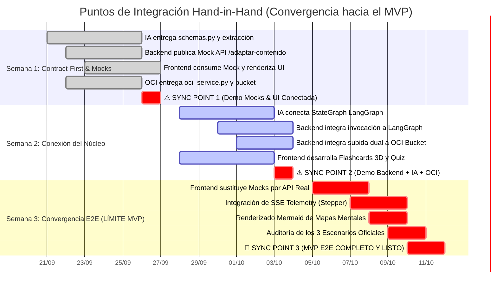

# PLAN MAESTRO INTEGRADO DE INGENIERÍA: IA, BACKEND, CLOUD Y FRONTEND
## Proyecto: NuevaMente — Plataforma Educativa Inteligente
**Hackathon:** ONE (Oracle Next Education) & Alura Latam — Cohorte G-10  
**Carácter:** Especificación Operativa de Integración y Catálogo de Tareas por Squad  
**Estado:** Aprobado para Ejecución (Semana 0 a Semana 5)

---

## 1. Arquitectura de Integración de Extremo a Extremo (E2E)

El sistema **NuevaMente** funciona como un ecosistema síncrono y desacoplado donde cuatro squads de ingeniería interactúan a través de contratos de datos formales tipados en **Pydantic V2**:

```mermaid
flowchart TD
    subgraph SQUAD_FE["🟣 SQUAD FRONTEND & UX (Karen G. & Cristian C.)"]
        UI_UPLOAD["1. Zona de Carga Drag & Drop<br>(PDF / Markdown / TXT)"]
        UI_SELECTORS["2. Selectores de Contexto<br>• Rol: Junior | Senior | Ejecutivo<br>• Formato: Flashcards | Quiz | Mapa"]
        UI_STEPPER["3. Stepper de Telemetría en Vivo<br>(EventSource / SSE 5 Fases)"]
        UI_RENDER["4. Visor Didáctico Polimórfico<br>• Flashcards 3D con Atajos<br>• Quiz con Feedback Inmediato<br>• Mapa Mental Mermaid.js"]
    end

    subgraph SQUAD_BE["🟠 SQUAD BACKEND (Diego M., Cristian C., Alexis P., Joaquín R.)"]
        API_ROUTER["FastAPI Router (Puerto 8000)<br>POST /api/v1/adaptar-contenido"]
        API_SSE["Servicio SSE de Telemetría<br>POST /api/v1/adaptar-contenido/stream"]
        BE_ORCH["Controlador de Flujo E2E<br>Orquestación Ingesta -> IA -> Nube"]
    end

    subgraph SQUAD_IA["🔵 SQUAD IA & DATA (Marcos H., Fernando F., Andy M., Jacqueline R.)"]
        IA_EXTRACT["Extractor PyMuPDF (fitz)<br>Limpieza y Preservación de Tablas"]
        IA_CHUNK["Chunking Jerárquico Contextual<br>(800 tokens / 150 overlap)"]
        IA_VDB[("ChromaDB Local<br>Embeddings: Gemini / FastEmbed")]
        IA_GRAPH["LangGraph State Machine (5 Agentes)<br>• Router -> Retriever -> Drafting<br>• Critic (anclaje_score >= 0.85)<br>• Formatter (Pydantic V2)"]
    end

    subgraph SQUAD_OCI["🟠 SQUAD OCI ALWAYS FREE (Alexis P. & Joaquín R.)"]
        OCI_SDK["Módulo oci_service.py<br>(OCI Python SDK con Claves RSA)"]
        BUCKET_RAW["OCI Object Storage<br>/raw_sources/{id_doc}.pdf"]
        BUCKET_JSON["OCI Object Storage<br>/generated_content/{id_doc}.json"]
        OCI_BUDGET["OCI Budgets Alarm ($0.00 USD)<br>Blindaje de Coste Cero"]
    end

    %% Conexiones e Integraciones
    UI_UPLOAD -->|Multipart File Upload| API_ROUTER
    UI_SELECTORS -->|JSON Payload| API_ROUTER
    API_ROUTER -->|1. Binario Original| OCI_SDK
    OCI_SDK --> BUCKET_RAW
    
    API_ROUTER -->|2. Despacho a Pipeline| IA_EXTRACT
    IA_EXTRACT --> IA_CHUNK --> IA_VDB
    IA_VDB <-->|Búsqueda Semántica Top-5| IA_GRAPH
    
    IA_GRAPH -.->|Eventos de Fase (1 a 5)| API_SSE
    API_SSE -.->|Stream Server-Sent Events| UI_STEPPER
    
    IA_GRAPH -->|3. JSON Validado| BE_ORCH
    BE_ORCH -->|4. Persistir JSON Generado| OCI_SDK
    OCI_SDK --> BUCKET_JSON
    
    BE_ORCH -->|5. HTTP 200 JSON Canónico| UI_RENDER
```

---

## 2. Pilar 1: Inteligencia Artificial y Datos (Squad IA / DATA)

### 2.1 Equipo y Roles
* **Marcos Gael Hernández Cruz (Líder IA / AI Engineer):** Arquitectura del grafo LangGraph, prompts Few-Shot, agente crítico de anclaje, generador de sintaxis Mermaid y contratos Pydantic V2.
* **Fernando Falla (Data Engineer):** Pipeline de ingesta con `pymupdf`, algoritmos de chunking jerárquico y vector store ChromaDB.
* **Andy Mijail Martinez Solis (Data Analyst / Prompt QA — Turno Mañana):** Curaduría de 3 manuales oficiales en `data/raw/`, diseño de ejemplos Few-Shot en lenguaje natural con ChatGPT/Claude y validación manual de salidas.
* **Jacqueline Rioja (Apoyo IA y Gobernanza):** Supervisión de calidad de datos y sincronización de dependencias con Kanban.

### 2.2 Decisiones Técnicas Clave
1. **Factoría de Modelos Desacoplada (`src/ai/config.py`):**
   * Primario: **Google Gemini 2.5/3.0 Flash** vía Google AI Studio (15 RPM, 1,500 RPD gratuitos).
   * Failover de Alta Velocidad: **Groq Cloud `llama-3.3-70b-versatile`** (30 RPM, 1,000 RPD, >300 tok/s).
2. **Chunking Semántico:** `RecursiveCharacterTextSplitter` con separadores `["\n## ", "\n### ", "\n```", "\n\n", "\n", " "]`, tamaño de 800 tokens y solapamiento de 150 tokens con metadatos de archivo, sección y página.
3. **Agente Crítico:** Cálculo de `anclaje_fuente_score = (afirmaciones_justificadas) / (total_afirmaciones)`. Si score $< 0.85$, reintento correctivo acotado a $\le 2$ iteraciones.

### 2.3 Matriz de Tareas del Squad IA

| Código | Actividad | Responsable | Dependencia | Entregable Técnico | Prioridad |
|---|---|---|---|---|:---:|
| **IA-01** | Ingesta de Documentos (PDF/MD/TXT) | Fernando Falla | Ninguna | Módulo `src/ai/ingestion/extractor.py` con `pymupdf` retornando texto estructurado y metadatos de página. | **MVP** |
| **IA-02** | Chunking Jerárquico Contextual | Fernando Falla | IA-01 | Módulo `src/ai/ingestion/chunker.py` con separadores Markdown y encabezados semánticos inyectados. | **MVP** |
| **IA-03** | Vector Store ChromaDB & Embeddings | Fernando Falla | IA-02 | Módulo `src/ai/embeddings/vector_store.py` conectado a `text-embedding-004` con namespace por documento. | **MVP** |
| **IA-04** | Curaduría de 3 Manuales Oficiales | Andy Mijail / Fernando | Ninguna | 3 documentos limpios en `data/raw/` (VCN OCI, Autenticación JWT, Arquitectura Microservicios). | **MVP** |
| **IA-05** | Factoría de LLM y System Prompts | Marcos Gael | Ninguna | `src/ai/config.py` con factoría Gemini/Groq y prompts para los 3 roles (Junior, Senior, Ejecutivo). | **MVP** |
| **IA-06** | Orquestador Multi-Agente (LangGraph) | Marcos Gael | IA-03, IA-05 | `src/ai/agents/graph.py` con nodos Router, Retriever, Drafting y Formatter. | **MVP** |
| **IA-07** | Agente Crítico de Calidad Fáctica | Marcos Gael | IA-06 | Nodo de auditoría en `temperature=0.0` calculando `anclaje_fuente_score` con cota de convergencia $\le 2$. | **MVP** |
| **IA-08** | Banco de Ejemplos Few-Shot | Andy Mijail | IA-05 | Banco de preguntas/respuestas de referencia calibradas para mitigar alucinaciones. | Importante |
| **IA-09** | Generador de Mapas Mentales Mermaid | Marcos Gael | IA-06 | Función generadora de sintaxis jerárquica `mindmap` validada. | Importante |
| **IA-10** | Matriz de Certificación (Escenarios A, B, C) | Andy Mijail / Jacqueline | IA-07, BE-02 | Reporte de pruebas funcionales ejecutadas sobre los 3 manuales con score $\ge 0.85$. | **MVP** |

---

## 3. Pilar 2: Backend y Servicios API (Squad Backend)

### 3.1 Equipo y Roles
* **Diego Mendez (Backend Lead):** Scaffolding de FastAPI, controladores de endpoints, validación de esquemas Pydantic y middlewares de seguridad.
* **Cristian Cortes (Full Stack Engineer):** Desarrollo del servicio Server-Sent Events (SSE) para el stepper, integración con Frontend y serialización JSON.
* **Alexis Perez (DevOps & Backend Engineer):** Empaquetado Docker, automatización de background tasks y testing de integración.
* **Joaquín Rojas Yaccuzzi (Cloud Engineer):** Integración con OCI SDK Python, persistencia dual y gestión de alertas OCI Budgets ($0.00 USD).

### 3.2 Decisiones Técnicas Clave
1. **Desacoplamiento Temprano con Mocks:** Endpoint mockeado operativo en los primeros días para que Frontend no espere a la finalización de LangGraph.
2. **Streaming de Telemetría (SSE):** Endpoint `/stream` que publica eventos asíncronos en tiempo real para activar las 5 fases del stepper visual.
3. **Persistencia Dual Automática:** Subida transparente del archivo de origen y del artefacto JSON resultante a OCI Object Storage.

### 3.3 Matriz de Tareas del Squad Backend

| Código | Actividad | Responsable | Dependencia | Entregable Técnico | Prioridad |
|---|---|---|---|---|:---:|
| **BE-01** | Scaffolding de Proyecto FastAPI y CORS | Diego / Cristian C. | Ninguna | API base ejecutable en puerto 8000 con Swagger interactivo en `/docs`. | **MVP** |
| **BE-02** | Endpoint Mock para Desbloqueo de UI | Diego Mendez | Ninguna | `POST /api/v1/adaptar-contenido` respondiendo mock JSON canónico en $< 200\text{ms}$. | **MVP** |
| **BE-03** | Integración del Grafo LangGraph | Diego / Cristian C. / Marcos | IA-06, BE-02 | Controlador de FastAPI que ejecuta el pipeline multi-agente de forma asíncrona. | **MVP** |
| **BE-04** | Integración con OCI Object Storage | Joaquín / Alexis / Cristian C. | OCI-03, BE-03 | Subida dual automática (`/raw_sources/` y `/generated_content/`) con retorno de metadatos OCI. | **MVP** |
| **BE-05** | Emisor de Telemetría en Vivo (SSE) | Cristian Cortes / Diego | BE-03 | `POST /api/v1/adaptar-contenido/stream` emitiendo eventos de fase (1 a 5) al cliente. | Importante |
| **BE-06** | Pruebas de Integración y Fallback Local | Diego / Alexis | BE-04 | Manejo de excepciones 422 (archivo corrupto), 429 (rate limit) y fallback a guardado local si OCI falla. | **MVP** |
| **BE-07** | Empaquetado Docker y Docker Compose | Alexis Perez / Diego | BE-04 | `Dockerfile` y `docker-compose.yml` listos para ejecución reproducible en un comando. | Opcional |

---

## 4. Pilar 3: Cloud e Infraestructura (Squad OCI Always Free)

### 4.1 Equipo y Roles
* **Alexis Perez (OCI Specialist):** Aprovisionamiento del Tenancy Always Free, configuración de credenciales RSA, políticas IAM y OCI Budgets.
* **Joaquín Rojas Yaccuzzi (OCI Specialist):** Aprovisionamiento de Buckets de Object Storage, módulo de integración con Python SDK y apoyo en despliegue.

### 4.2 Decisiones Técnicas Clave
1. **Blindaje de Coste Cero ($0.00 USD):** Regla de alarma en **OCI Budgets** a $0.01 USD con alerta por correo para garantizar cumplimiento estricto de la política Always Free de Oracle ONE.
2. **Estructura Canónica del Bucket:**
   * Bucket: `nuevamente-contenidos-educativos` (Standard Tier, Always Free).
   * Prefijo 1: `raw_sources/{id_documento}.{pdf|md|txt}`
   * Prefijo 2: `generated_content/{id_documento}_{perfil}_{formato}.json`
3. **Despliegue OCI Compute (Diferencial Opcional):** VM Linux Ampere (Arm) o AMD Micro Always Free ejecutando la solución con Docker.

### 4.3 Matriz de Tareas del Squad OCI

| Código | Actividad | Responsable | Dependencia | Entregable Técnico | Prioridad |
|---|---|---|---|---|:---:|
| **OCI-01** | Verificación de Tenancy Always Free y Claves | Alexis / Joaquín | Ninguna | Tenancy activo, usuario de servicio, clave privada RSA y archivo `.env.example` formalizado. | **MVP** |
| **OCI-02** | Creación de Bucket en Object Storage | Alexis / Joaquín | OCI-01 | Bucket `nuevamente-contenidos-educativos` creado con visibilidad privada y carpetas estructuradas. | **MVP** |
| **OCI-03** | Módulo de Conexión con OCI SDK Python | Alexis / Joaquín | OCI-01, OCI-02 | Archivo `src/cloud/oci_service.py` con métodos `upload_raw_source()` y `upload_generated_json()`. | **MVP** |
| **OCI-04** | Alarma Presupuestaria OCI Budgets ($0.01 USD) | Alexis Perez | OCI-01 | Regla de presupuesto configurada en consola de OCI garantizando consumo de $0.00 USD. | **MVP** |
| **OCI-05** | Aprovisionamiento de VM Compute en OCI | Alexis / Joaquín | BE-07 | Instancia Linux Always Free con puertos 80/443 abiertos para hostear la solución. | Opcional |

---

## 5. Pilar 4: Frontend y Experiencia de Usuario (Squad Frontend & UX)

### 5.1 Equipo y Roles
* **Karen Macarena González (Líder Frontend / UX Lead):** Sistema de diseño "Minimalismo Clásico Tecnológico", maquetación de vistas, selectores de rol/formato y Stepper de telemetría.
* **Cristian Cortes (Full Stack Support):** Conexión HTTP/SSE con FastAPI, animación de Flashcards 3D, evaluador de quizzes y visualizador de mapas mentales Mermaid.

### 5.2 Decisiones Técnicas Clave
1. **Despacho Polimórfico de Componentes:** Un selector visual en React/Streamlit que conmuta entre `<FlashcardsDeck />`, `<InteractiveQuiz />` y `<MindmapCanvas />` según el campo `metadatos.formato_generado`.
2. **Stepper en Tiempo Real:** Componente visual de 5 pasos que consume el stream SSE y muestra el estado actual con micropulsaciones e indicadores de progreso.
3. **Interactividad Pedagógica de Alto Impacto:**
   * *Flashcards:* Volteo 3D con barra espaciadora y teclado (flechas de navegación).
   * *Quizzes:* Selección de 1 de 4 alternativas con revelación instantánea de acierto (verde) o error (rojo) y panel desplegable de justificación didáctica.
   * *Mapas Mentales:* Renderizado fluido de sintaxis Mermaid.js con controles de zoom y pan.

### 5.3 Matriz de Tareas del Squad Frontend

| Código | Actividad | Responsable | Dependencia | Entregable Técnico | Prioridad |
|---|---|---|---|---|:---:|
| **FE-01** | Scaffolding de UI y Sistema de Tokens | Karen Gonzalez | Ninguna | Aplicación web base con paleta monocromática, tipografía Sans e interacciones fluidas. | **MVP** |
| **FE-02** | Zona de Carga de Archivos (Drag & Drop) | Karen Gonzalez | FE-01 | Componente con validación de extensiones `.pdf`, `.md`, `.txt` y previsualización de peso. | **MVP** |
| **FE-03** | Selectores de Perfil y Formato | Karen Gonzalez | FE-01 | Controles para los 3 roles (Junior, Senior, Ejecutivo) y 3 formatos didácticos principales. | **MVP** |
| **FE-04** | Stepper de Telemetría en Vivo (5 Fases) | Karen Gonzalez / Cristian | FE-01, BE-05 | Barra de progreso dinámica que se activa al procesar y refleja los eventos SSE de la API. | Importante |
| **FE-05** | Cliente de Conexión con FastAPI | Cristian Cortes / Karen | BE-02, FE-03 | Servicio HTTP que consume endpoint mock/real gestionando estados de carga y errores. | **MVP** |
| **FE-06** | Visor de Tarjetas 3D (Flashcards) | Cristian Cortes / Karen | IA-05, FE-05 | Componente de tarjetas interactivas volteables con atajos de teclado y pistas. | **MVP** |
| **FE-07** | Evaluador de Quizzes con Feedback | Cristian Cortes / Karen | IA-05, FE-05 | Interfaz de 4 alternativas seleccionables con revelación de respuesta y justificación. | **MVP** |
| **FE-08** | Visor de Mapas Mentales Mermaid | Cristian Cortes / Karen | IA-09, FE-05 | Lienzo interactivo que compila el bloque `mindmap` con zoom y exportación SVG. | Importante |
| **FE-09** | Panel de Auditoría de Calidad y Badge OCI | Karen Gonzalez | BE-04, FE-05 | Visualizador del `anclaje_fuente_score`, observaciones críticas y enlace a OCI Object Storage. | **MVP** |

---

## 6. Matriz de Handshake: Puntos de Encuentro entre Squads

```
┌─────────────────┬─────────────────┬───────────────────────────────┬──────────────────────────┐
│ Squad Emisor    │ Squad Receptor  │ Artefacto / Interfaz          │ Criterio de Aceptación   │
├─────────────────┼─────────────────┼───────────────────────────────┼──────────────────────────┤
│ OCI             │ Backend         │ Módulo oci_service.py         │ upload/download exitoso  │
│                 │                 │ y archivo .env con claves     │ en bucket Always Free    │
├─────────────────┼─────────────────┼───────────────────────────────┼──────────────────────────┤
│ IA & Data       │ Backend         │ Función run_agent_graph()     │ Recibe State y retorna   │
│                 │                 │ y esquemas schemas.py         │ Pydantic Response válido │
├─────────────────┼─────────────────┼───────────────────────────────┼──────────────────────────┤
│ Backend         │ Frontend        │ Endpoint Mock FastAPI         │ Responde en < 200 ms con │
│                 │                 │ POST /api/v1/adaptar-contenido│ esquema JSON canónico    │
├─────────────────┼─────────────────┼───────────────────────────────┼──────────────────────────┤
│ Backend         │ Frontend        │ Endpoint SSE Telemetría       │ Emite fases 1 a 5        │
│                 │                 │ POST /stream                  │ en tiempo real al stepper│
├─────────────────┼─────────────────┼───────────────────────────────┼──────────────────────────┤
│ IA (Andy/Marcos)│ Todos (Pitch)   │ 3 Casos Oficiales Certificados│ JSONs reales en OCI con  │
│                 │                 │ (Junior, Senior, Ejecutivo)   │ anclaje_score >= 0.85    │
└─────────────────┴─────────────────┴───────────────────────────────┴──────────────────────────┘
```

---

## 7. Plan de Validación de los 3 Casos Oficiales de Demostración

Para asegurar la máxima calificación ante el jurado calificador de Oracle ONE y Alura, certificaremos la solución ejecutando de punta a punta tres combinaciones únicas:

1. **Escenario A (Público Masivo / Inclusión Digital):**
   * *Documento:* `manual-redes-vcn-oracle.pdf`
   * *Rol:* **Junior**
   * *Formato:* **Flashcards (Tarjetas 3D)**
   * *Criterio de Evaluación:* Uso de analogías del mundo real, 0% acrónimos sin explicar, score de anclaje $\ge 0.90$.
2. **Escenario B (Evaluación Técnica Rigurosa):**
   * *Documento:* `guia-seguridad-tokens-jwt.md`
   * *Rol:* **Senior / Líder Técnico**
   * *Formato:* **Quiz Interactivo con Justificaciones Técnicas**
   * *Criterio de Evaluación:* Preguntas situacionales sobre vulnerabilidades y algoritmos criptográficos, justificación profunda de por qué fallan los distractores.
3. **Escenario C (Toma de Decisiones Estratégica):**
   * *Documento:* `arquitectura-microservicios-cloud.txt`
   * *Rol:* **Ejecutivo / Gestor**
   * *Formato:* **Mapa Mental (Mermaid.js) + Resumen Ejecutivo (TL;DR)**
   * *Criterio de Evaluación:* Diagrama jerárquico de impacto comercial, análisis de trade-offs de coste/disponibilidad y recomendaciones de gobernanza.

---

## 8. Protocolo de Integración Sincronizada y Cadencia Hand-in-Hand ("Ir de la Mano")

Para garantizar que los cuatro squads avancen de forma coordinada, sin puntos ciegos ni bloqueos mutuos, se establece el siguiente protocolo de integración continua y sincronización táctica:

### 8.1 Los 3 Puntos de Control de Integración E2E (Checkpoints Semanales)



### 8.2 Descripción de los 3 Handshakes de Integración

| Sync Point | Fecha Límite | Squads Involucrados | Objetivo del Handshake | Criterio de Éxito Conjunto |
|:---:|:---:|:---:|---|---|
| **Sync 1: Desacoplamiento** | **Viernes 26 Sep** | Todos los Squads | **Validación de Contratos y Desbloqueo de UI:** Backend levanta el mock de FastAPI; Frontend se conecta y renderiza sin errores; IA prueba extracción PyMuPDF; OCI valida subida de archivo prueba. | Frontend muestra la carga de archivo y recibe JSON mock en $< 200\text{ms}$. Cero bloqueos. |
| **Sync 2: Núcleo IA + Nube** | **Viernes 03 Oct** | Backend + IA + OCI | **Conexión del Cerebro y Persistencia:** Backend sustituye el mock interno por la llamada real a `run_agent_graph()` y persiste los resultados en el bucket de OCI Always Free. | Desde Swagger (`/docs`) o Postman, un PDF subido ejecuta LangGraph y genera el JSON persistido en OCI con URL verificable. |
| **Sync 3: MVP Total E2E** | **Viernes 10 Oct** | Todos los Squads | **⚠️ HITO LÍMITE DE ENTREGA DEL MVP:** Frontend se conecta a la API real; el Stepper dinámico se anima con eventos SSE en vivo; los 3 formatos (Flashcards, Quiz, Mapa) son 100% interactivos. | Un usuario sube un PDF desde el navegador web y visualiza el contenido adaptado con auditoría anti-alucinaciones ($\ge 0.85$). |

### 8.3 Política "Zero-Blockers" (Desacoplamiento Resiliente)

Para que ningún squad detenga su ritmo si otro equipo encuentra un imprevisto técnico:
1. **Frontend nunca espera a IA:** Si el grafo de LangGraph requiere ajustes de prompts, Frontend continúa implementando componentes consumiendo el mock canónico (`mock_data.js` o `/api/v1/adaptar-contenido` mock).
2. **Backend nunca espera a OCI:** Si las credenciales o cuota de OCI tienen latencia de configuración, Backend activa un *LocalFileStorageDriver* en `data/outputs/` con la misma interfaz para no frenar la orquestación.
3. **IA cuenta con Failover de Proveedor:** Si Google AI Studio (Gemini 2.5 Flash) sufre un rate limit (429), la factoría conmuta de inmediato y de forma transparente a Groq Cloud (`llama-3.3-70b-versatile`) sin intervención manual.

### 8.4 Cadencia Diaria y Canales de Sincronización
* **Daily Asíncrono (10:00 am):** Cada líder de squad (Karen, Diego, Marcos, Alexis) publica en el canal general de Discord/Slack 3 viñetas:
  1. *Qué logramos ayer.*
  2. *Qué integramos hoy.*
  3. *Bloqueos o dependencias críticas de otros squads.*
* **Branching de Integración:** Todo merge a la rama `develop` requiere que el PR apruebe la suite de contratos (`pytest tests/test_contracts.py`) para asegurar que nadie rompa los esquemas JSON de los demás.
