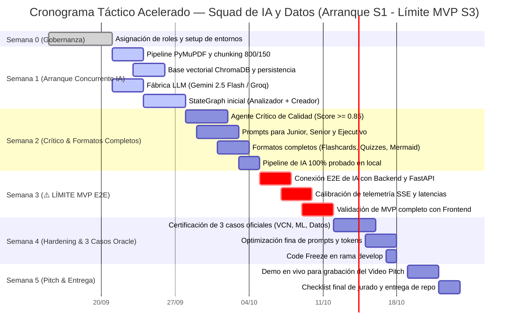

# PLAN OPERATIVO DE TRABAJO — SQUAD DE IA Y DATOS
## Proyecto: NuevaMente — Plataforma Educativa Inteligente
**Hackathon:** ONE (Oracle Next Education) & Alura Latam — Cohorte G-10  
**Squad:** Inteligencia Artificial & Ingeniería de Datos  


---

## 1. Asignación de Roles e Integrantes del Squad

| Integrante | Rol en el Squad | Responsabilidades Clave |
|---|---|---|
| **Marcos Gael Hernández Cruz** | ** AI Engineer** | Arquitectura y orquestación con **LangGraph** (StateGraph), diseño de la máquina de estados, implementación de agentes generador y crítico, lógica del loop de refinamiento ($\le 2$ iteraciones). |
| **Fernando Falla** | **Data Engineer / RAG Pipeline** | Extracción multimodal con **PyMuPDF**, limpieza de markdown/texto, chunking recursivo jerárquico (800 tokens, 150 solapamiento), configuración e indexación en **ChromaDB**. |
| **Andy Mijail Martinez Solis** | **Prompt QA & Evaluación Pedagógica** | Ingeniería de prompts para los 3 perfiles (**Junior**, **Senior / Arquitecto**, **Ejecutivo / Gestor**), validación de esquemas JSON estructurados, calibración del índice de fidelidad (`anclaje_fuente_score >= 0.85`). |
| **Jacqueline Rioja** | **Gobernanza de Datos & Soporte IA** | Curaduría de datasets de prueba (documentos técnicos de Oracle Cloud, Machine Learning y Data Governance), verificación de consistencia de salida y métricas de latencia/tokens. |

---

## 2. Autonomía y Desacoplamiento Operativo

> [!IMPORTANT]
> **Garantía de Trabajo Independiente:**
> El Squad de IA **no depende del servidor FastAPI ni del Frontend** para avanzar. 
> - Todo el desarrollo y prueba del pipeline se realiza directamente sobre `src/ai/`, ejecutándose mediante scripts de prueba CLI y tests unitarios automatizados con `pytest`.
> - La única interfaz pública que el Squad entrega a Backend es una función asíncrona:
>   ```python
>   async def ejecutar_pipeline_adaptacion(
>       request: AdaptacionContenidoRequest,
>       progress_callback: Optional[Callable[[TelemetriaEstadoResponse], None]] = None
>   ) -> AdaptacionContenidoResponse:
>       ...
>   ```
> - Se garantiza el cumplimiento estricto de los contratos canónicos de datos Pydantic V2 especificados en la **Sección 3** de este documento.

---

## 3. Modelos de Datos y Esquemas Pydantic V2 Canónicos

Para que este plan sea 100% autosuficiente, a continuación se definen los esquemas tipados que el pipeline de IA debe consumir, procesar y producir:

```python
from enum import Enum
from typing import List, Optional, Union
from pydantic import BaseModel, Field


# --- ENUMS CANÓNICOS (3 PERFILES DEFINIDOS) ---

class PerfilDestinatarioEnum(str, Enum):
    JUNIOR = "Junior"
    SENIOR = "Senior"
    EJECUTIVO = "Ejecutivo"


class FormatoSalidaEnum(str, Enum):
    FLASHCARDS = "Flashcards"
    QUIZ_INTERACTIVO = "Quiz Interactivo"
    MAPA_MENTAL = "Mapa Mental"
    GUIA_PASO_A_PASO = "Guia Paso a Paso"
    RESUMEN_EJECUTIVO = "Resumen Ejecutivo"


class NichoSectorEnum(str, Enum):
    FINTECH = "Fintech"
    SALUD = "Salud"
    ECOMMERCE = "E-commerce"
    GENERAL = "General"


class NivelDetalleEnum(str, Enum):
    DIDACTICO = "Didactico"
    TECNICO_INTERMEDIO = "Tecnico Intermedio"
    EXHAUSTIVO = "Exhaustivo"


class FaseProgresoEnum(str, Enum):
    EXTRACCION = "EXTRACCION"
    INDEXACION = "INDEXACION"
    GENERACION = "GENERACION"
    AUDITORIA = "AUDITORIA"
    PERSISTENCIA = "PERSISTENCIA"
    COMPLETADO = "COMPLETADO"
    ERROR = "ERROR"


# --- MODELOS POR FORMATO DIDÁCTICO ---

class FlashcardItem(BaseModel):
    frente: str = Field(..., description="Concepto, término o pregunta clave")
    dorso: str = Field(..., description="Definición o explicación pedagógica adaptada")
    pista_didactica: str = Field(..., description="Analogía o pista mnemotécnica del mundo real")
    categoria_dificultad: Optional[str] = Field(default="Intermedio")
    identificador: Optional[int] = Field(default=None)


class QuizItem(BaseModel):
    pregunta: str = Field(..., description="Enunciado de la pregunta técnica contextualizada")
    opciones: List[str] = Field(..., min_items=4, max_items=4, description="Lista de 4 alternativas")
    indice_correcto: int = Field(..., ge=0, le=3, description="Índice (0-3) de la opción correcta")
    justificacion_tecnica: str = Field(..., description="Explicación exhaustiva de la respuesta válida")
    pista_didactica: Optional[str] = Field(None, description="Pista mnemotécnica")
    explicacion_distractores: Optional[str] = Field(None, description="Análisis de por qué fallan las demás opciones")
    referencia_fuente: Optional[str] = Field(None)
    identificador: Optional[int] = Field(default=None)


class SubnodoConceptual(BaseModel):
    titulo: str = Field(..., description="Subtema o concepto específico")
    detalles: List[str] = Field(default_factory=list, description="Propiedades o ejemplos clave")


class RamaTematica(BaseModel):
    nombre_rama: str = Field(..., description="Pilar temático o módulo principal")
    subnodos: List[SubnodoConceptual] = Field(default_factory=list)


class MapaMentalContenido(BaseModel):
    nodo_central: str = Field(..., description="Tema central del documento técnico")
    descripcion_general: str = Field(..., description="Resumen conceptual del árbol temático")
    ramas_principales: List[RamaTematica] = Field(...)
    codigo_mermaid: str = Field(..., description="Sintaxis formal de Mermaid (mindmap) lista para renderizar")


class PasoTutorial(BaseModel):
    numero: int = Field(..., ge=1)
    titulo: str = Field(...)
    instrucciones: str = Field(...)
    snippet_codigo_o_comando: Optional[str] = Field(None)
    resultado_esperado: str = Field(...)


class ResumenEjecutivoContenido(BaseModel):
    vision_general: str = Field(...)
    puntos_clave_negocio: List[str] = Field(...)
    consideraciones_arquitectura: List[str] = Field(...)
    recomendaciones_implementacion: List[str] = Field(...)


# --- CONTENEDOR POLIMÓRFICO ---

class PaqueteContenidoAdaptado(BaseModel):
    titulo: str = Field(..., description="Título contextualizado del paquete didáctico")
    introduccion_contextualizada: str = Field(..., description="Analogía o visión adaptada al perfil")
    items: Union[
        List[FlashcardItem],
        List[QuizItem],
        MapaMentalContenido,
        List[PasoTutorial],
        ResumenEjecutivoContenido,
    ] = Field(..., description="Elementos didácticos estructurados")


# --- PAYLOADS DE SOLICITUD Y RESPUESTA ---

class AdaptacionContenidoRequest(BaseModel):
    documento_titulo: str = Field(..., min_length=3, max_length=150)
    documento_contenido: str = Field(..., min_length=50)
    perfil_destinatario: PerfilDestinatarioEnum = Field(default=PerfilDestinatarioEnum.JUNIOR)
    formato_salida: FormatoSalidaEnum = Field(default=FormatoSalidaEnum.FLASHCARDS)
    nicho_sector: NichoSectorEnum = Field(default=NichoSectorEnum.GENERAL)
    nivel_detalle: NivelDetalleEnum = Field(default=NivelDetalleEnum.DIDACTICO)


class MetadatosAprendizaje(BaseModel):
    perfil_aplicado: str
    formato_generado: str
    tiempo_estimado_estudio_minutos: int = Field(..., ge=1)
    conceptos_clave: List[str]
    nicho_contexto: Optional[str] = Field(default="General")


class EvaluacionCalidad(BaseModel):
    anclaje_fuente_score: float = Field(..., ge=0.0, le=1.0, description="Índice de fidelidad fáctica")
    claridad_pedagogica: str = Field(..., description="Alta | Media | Baja")
    observaciones: str = Field(..., description="Dictamen y adecuación de lenguaje del Crítico")
    clasificacion_fidelidad: Optional[str] = Field(default=None)


class AlmacenamientoOCI(BaseModel):
    bucket: str = Field(default="nuevamente-contenidos-educativos")
    objeto_id: str
    status_upload: str = Field(default="completado")
    region: Optional[str] = Field(default="us-ashburn-1")
    tamano_bytes: Optional[int] = Field(default=None)


class AdaptacionContenidoResponse(BaseModel):
    status: str = Field(default="exito")
    metadatos: MetadatosAprendizaje
    contenido_adaptado: PaqueteContenidoAdaptado
    evaluacion_calidad: EvaluacionCalidad
    almacenamiento_oci: AlmacenamientoOCI
    codigo_respuesta: Optional[int] = Field(default=200)


class TelemetriaEstadoResponse(BaseModel):
    fase_actual: FaseProgresoEnum
    fase_numero: int = Field(..., ge=1, le=5)
    porcentaje_progreso: int = Field(..., ge=0, le=100)
    mensaje_descriptivo: str
    tiempo_transcurrido_segundos: float = Field(default=0.0)
    error_detalle: Optional[str] = Field(default=None)
```

---

## 4. Estructura de Directorios del Módulo de IA

```text
src/ai/
├── __init__.py
├── config.py                 # Fábrica agnóstica de LLMs (Gemini 2.5/3.0 Flash, Groq, Ollama)
├── state.py                  # Definición del TypedDict EstadoPipelineAdaptacion
├── ingestion/
│   ├── __init__.py
│   ├── extractor.py          # Extracción con PyMuPDF (PDF), lectura MD y TXT
│   └── chunker.py            # RecursiveCharacterTextSplitter (800 tokens / 150 overlap)
├── rag/
│   ├── __init__.py
│   ├── embeddings.py         # Google Gemini Embeddings / FastEmbed
│   └── vectorstore.py        # Inicialización y persistencia en ChromaDB
├── prompts/
│   ├── __init__.py
│   ├── perfiles.py           # Prompts de sistema para Junior, Senior y Ejecutivo
│   └── formatos.py           # Few-shot prompts para Flashcards, Quizzes, Mapas Mermaid
├── agents/
│   ├── __init__.py
│   ├── analizador.py         # Agente 1: Extracción de conceptos clave
│   ├── perfilador.py         # Agente 2: Establecimiento del tono didáctico
│   ├── creador.py            # Agente 3: Generación estructurada con salida tipada
│   ├── critico.py            # Agente 4: Evaluación de fidelidad semántica
│   └── ensamblador.py        # Agente 5: Empaquetado final Pydantic V2
├── graph.py                  # Ensamblado del StateGraph de LangGraph
└── pipeline.py               # Función pública ejecutar_pipeline_adaptacion()
```

---

## 5. Hoja de Ruta y Timeline de Ejecución (Flujo Acelerado de IA desde Semana 1 — Límite MVP Semana 3)

> [!IMPORTANT]
> **Ventana Estratégica de Desarrollo Acelerado de IA:**
> - **Semana 0 (15 al 20 Septiembre):** Gobernanza, asignación de roles, repositorio y dependencias de Python instaladas. **Cero líneas de código.**
> - **Semana 1 (21 al 27 Septiembre):** **Arranque activo integral de IA desde el día 1:**
>   - Ingestión multimodal con PyMuPDF, chunking semántico (800/150) e indexación en ChromaDB.
>   - Fábrica desacoplada de LLMs (`config.py`) conectando Gemini 2.5 Flash y Groq.
>   - StateGraph inicial de LangGraph con nodos Analizador y Creador generando ya contenidos pedagógicos preliminares.
> - **Semana 2 (28 Septiembre al 04 Octubre):**
>   - Agente Crítico de Calidad con loop de retroalimentación ($\le 2$ iteraciones, umbral $\ge 0.85$).
>   - Prompts calibrados para los 3 perfiles (Junior, Senior, Ejecutivo) y los 5 formatos (Flashcards, Quizzes, Mermaid, etc.).
>   - Pipeline de IA completado y listo para integración con Backend al cierre de Semana 2.
> - **Semana 3 (05 al 11 Octubre) — ⚠️ HITO CRÍTICO: LÍMITE DE ENTREGA DEL MVP FUNCIONAL:**
>   - Convergencia E2E fluida con Backend (FastAPI, SSE y OCI Object Storage) y Frontend.
>   - Optimización de latencia y reducción de tokens para el MVP.
> - **Semana 4 (12 al 18 Octubre):** Auditoría anti-alucinaciones en los 3 casos oficiales de Oracle, hardening y Code Freeze.
> - **Semana 5 (19 al 24 Octubre):** Demostración en vivo, soporte al Video Pitch y entrega final.



### Entregables Clave por Semana del Squad de IA (Flujo Acelerado):
| Semana | Fechas | Objetivo Principal | Entregable Técnico Verificable |
|---|---|---|---|
| **Semana 0** | 15 - 20 Sep | Organización & Setup | Entorno virtual configurado con dependencias de LangGraph, PyMuPDF y ChromaDB. |
| **Semana 1** | 21 - 27 Sep | **Arranque Activo de IA** | **Pipeline funcional básico:** PyMuPDF extrayendo texto, ChromaDB indexando fragmentos y StateGraph inicial generando Flashcards preliminares con Gemini 2.5 Flash. |
| **Semana 2** | 28 Sep - 04 Oct | **Cierre del Pipeline de IA** | **Pipeline Multi-Agente completo:** Agente Crítico operativo ($\le 2$ loops, score $\ge 0.85$), prompts para los 3 perfiles y generación de Mapas Mermaid, Flashcards y Quizzes. |
| **Semana 3** | **05 - 11 Oct** | **⚠️ HITO LÍMITE MVP** | **Convergencia E2E del MVP:** `ejecutar_pipeline_adaptacion()` conectada a FastAPI, emitiendo telemetría SSE y persistiendo en OCI Object Storage. |
| **Semana 4** | 12 - 18 Oct | Hardening & Casos Oracle | Certificación de los 3 casos oficiales con fidelidad comprobada $\ge 0.85$. Code Freeze. |
| **Semana 5** | 19 - 24 Oct | Delivery & Pitch | Demostración en vivo para el Video Pitch oficial y cierre de entrega. |

---

## 6. Implementación Técnica Paso a Paso

### 6.1 Fábrica de Modelos Desacoplada (`src/ai/config.py`)
Garantiza que el sistema nunca falle si la cuota de una API se agota o si se requiere ejecutar localmente:

```python
import os
from langchain.chat_models import init_chat_model
from langchain_core.language_models.chat_models import BaseChatModel


def obtener_llm_adaptacion() -> BaseChatModel:
    """
    Retorna el modelo LLM configurado según variables de entorno.
    Prioridad:
    1. Google Gemini 2.5 / 3.0 Flash (Producción / Google AI Studio)
    2. Groq Llama 3.3 70B (Respaldo inmediato por cuota)
    3. Ollama Qwen 2.5 7B (Desarrollo local sin internet)
    """
    proveedor = os.getenv("LLM_PROVIDER", "google_genai").lower()

    if proveedor == "google_genai":
        return init_chat_model(
            model=os.getenv("GEMINI_MODEL", "gemini-2.5-flash"),
            model_provider="google_genai",
            temperature=0.2,
            api_key=os.getenv("GEMINI_API_KEY"),
        )
    elif proveedor == "groq":
        return init_chat_model(
            model=os.getenv("GROQ_MODEL", "llama-3.3-70b-versatile"),
            model_provider="groq",
            temperature=0.2,
            api_key=os.getenv("GROQ_API_KEY"),
        )
    elif proveedor == "ollama":
        return init_chat_model(
            model=os.getenv("OLLAMA_MODEL", "qwen2.5:7b"),
            model_provider="ollama",
            temperature=0.2,
            base_url=os.getenv("OLLAMA_BASE_URL", "http://localhost:11434"),
        )
    else:
        raise ValueError(f"Proveedor LLM desconocido: {proveedor}")
```

### 6.2 Ingestión y Chunking Semántico (`src/ai/ingestion/`)
- **Extracción (`extractor.py`):**
  - **PDF:** Utiliza `pymupdf` (`fitz`) para extraer el texto por páginas, extrayendo metadatos y eliminando cabeceras y pies de página redundantes.
  - **Markdown / TXT:** Lectura limpia en UTF-8 preservando jerarquía de títulos (`#`, `##`, `###`).
- **Chunking (`chunker.py`):**
  - Tamaño de fragmento: **800 tokens** (~3200 caracteres).
  - Solapamiento: **150 tokens** (~600 caracteres) para mantener continuidad semántica entre límites de sección.
  - Separadores jerárquicos: `["\n## ", "\n### ", "\n\n", "\n", ". ", " "]`.

### 6.3 Vector Store Local (`src/ai/rag/vectorstore.py`)
- Base vectorial: **ChromaDB** persistente en `./data/chroma_db/`.
- Cada chunk indexado contiene metadatos: `{ "documento": titulo, "pagina": num_pag, "chunk_id": id }`.
- Al realizar la consulta del perfilador, se recuperan los $k=4$ fragmentos de mayor similitud coseno.

### 6.4 Máquina de Estados LangGraph (`src/ai/state.py` y `src/ai/graph.py`)

```python
from typing import TypedDict, List, Optional
from src.contratos.schemas import (
    AdaptacionContenidoRequest,
    PaqueteContenidoAdaptado,
    EvaluacionCalidad,
    TelemetriaEstadoResponse
)

class EstadoPipelineAdaptacion(TypedDict):
    request: AdaptacionContenidoRequest
    documento_limpio: str
    chunks_recuperados: List[str]
    conceptos_clave: List[str]
    tono_y_estilo: str
    contenido_generado: Optional[PaqueteContenidoAdaptado]
    evaluacion_critico: Optional[EvaluacionCalidad]
    contador_intentos: int
    aprobado_por_critico: bool
```

**Flujo de Nodos y Condiciones:**
1. `nodo_analizador`: Extrae los conceptos eje del documento original. Emite evento SSE: `FaseProgresoEnum.INDEXACION`.
2. `nodo_perfilador`: Ajusta el vocabulario según el perfil (**Junior:** analogías cotidianas y explicaciones sin jerga; **Senior:** trade-offs arquitectónicos y rendimiento; **Ejecutivo:** impacto en negocio y ROI).
3. `nodo_creador`: Invoca al LLM con `.with_structured_output()` forzando el formato seleccionado (Flashcards, Quiz, etc.). Emite evento SSE: `FaseProgresoEnum.GENERACION`.
4. `nodo_critico`: Evalúa la fidelidad fáctica contra los fragmentos originales. Emite evento SSE: `FaseProgresoEnum.AUDITORIA`.
   - Si `anclaje_fuente_score >= 0.85` $\rightarrow$ Transición a `nodo_ensamblador`.
   - Si `anclaje_fuente_score < 0.85` y `contador_intentos < 2` $\rightarrow$ Retorna a `nodo_creador` con el feedback del crítico.
   - Si alcanza 2 intentos $\rightarrow$ Avanza a `nodo_ensamblador` adjuntando advertencia en `observaciones`.
5. `nodo_ensamblador`: Construye el objeto `AdaptacionContenidoResponse` final y emite evento SSE: `FaseProgresoEnum.COMPLETADO`.

### 6.5 Prompts de Sistema Calibrados por Perfil

#### Perfil Junior:
> *"Eres un mentor técnico de élite con alta pedagogía. Transforma la documentación técnica en explicaciones claras, amigables y accesibles. Utiliza analogías del mundo real para explicar conceptos complejos. Evita dar por sentado conocimientos avanzados y define los términos clave. Estructura el contenido para facilitar el aprendizaje incremental y la confianza técnica."*

#### Perfil Senior:
> *"Eres un arquitecto de software y consultor cloud senior. Analiza la documentación técnica extrayendo patrones de diseño, consideraciones de escalabilidad, trade-offs de rendimiento, seguridad y buenas prácticas de ingeniería. Ve directo al grano, omitiendo analogías básicas y enfatizando decisiones arquitectónicas críticas."*

#### Perfil Ejecutivo:
> *"Eres un asesor de tecnología para directores de negocio (C-Level). Traduce las características y especificaciones técnicas a impacto operativo, beneficios de negocio, costos, retorno de inversión (ROI), mitigación de riesgos y eficiencia organizacional. Redacta de forma concisa, con visión estratégica y lenguaje de gestión."*

---

## 7. Pruebas Unitarias y Criterios de Aceptación del Squad

El Squad debe validar el pipeline con el siguiente comando en la raíz:
```bash
pytest tests/test_ai_pipeline.py -v -s
```

### Dataset de Validación Obligatorio (3 Casos Oficiales):
1. **Caso 1: Oracle Cloud Infrastructure - Virtual Cloud Network (VCN)**
   - Perfil: *Junior* | Formato: *Flashcards* (mínimo 5 tarjetas).
   - Criterio: Score de fidelidad $\ge 0.90$, presencia de analogías claras y pista mnemotécnica.
2. **Caso 2: Pipeline de Machine Learning y Clasificación de Modelos**
   - Perfil: *Senior* | Formato: *Quiz Interactivo* (4 preguntas, 4 alternativas).
   - Criterio: Justificación técnica profunda y análisis de distractores.
3. **Caso 3: Gobernanza de Datos y Políticas de Retención Empresarial**
   - Perfil: *Ejecutivo* | Formato: *Mapa Mental Jerárquico* (Mermaid válido).
   - Criterio: Sintaxis Mermaid sin errores de parseo y ramas centradas en riesgo y costos.

---

## 8. Definición de Terminado (Definition of Done - DoD)
- [ ] Ingestor soporta `.pdf`, `.md` y `.txt` sin lanzar excepciones no controladas.
- [ ] Base vectorial ChromaDB indexa y recupera fragmentos con similitud coseno relevante.
- [ ] LangGraph completa la máquina de estados y converge siempre en $\le 2$ iteraciones del crítico.
- [ ] La salida generada valida al 100% el esquema Pydantic `AdaptacionContenidoResponse`.
- [ ] Pruebas unitarias en verde con cobertura mínima del 85% sobre `src/ai/`.
- [ ] Función `ejecutar_pipeline_adaptacion` lista para ser importada por el Squad de Backend.
