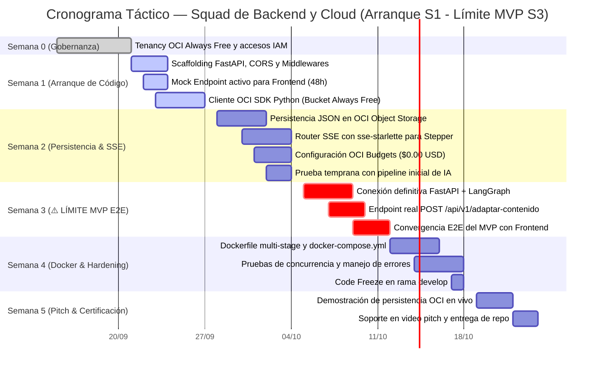

# PLAN OPERATIVO DE TRABAJO — SQUAD DE BACKEND Y CLOUD
## Proyecto: NuevaMente — Plataforma Educativa Inteligente
**Hackathon:** ONE (Oracle Next Education) & Alura Latam — Cohorte G-10  
**Squad:** Backend API & Nube Oracle Cloud Infrastructure (OCI)  
**Líder de Squad:** Diego Mendez  

---

## 1. Asignación de Roles e Integrantes del Squad

| Integrante | Rol en el Squad | Responsabilidades Clave |
|---|---|---|
| **Diego Mendez** | **Backend Lead & API Architect** | Estructura modular de **FastAPI**, middleware de seguridad/CORS, inyección de dependencias, diseño de endpoints REST y OpenAPI/Swagger. |
| **Cristian Cortes** | **Fullstack Integration & Streaming** | Conexión del mock endpoint y endpoints reales con el Squad de Frontend, implementación de streaming en tiempo real vía **Server-Sent Events (SSE)** con `sse-starlette` y serialización JSON. |
| **Alexis Perez** | **DevOps & Asynchronous Tasks** | Creación de `Dockerfile` multi-stage, orquestación con `docker-compose.yml`, gestión de background tasks asíncronas en FastAPI y CI/CD. |
| **Joaquín Rojas Yaccuzzi** | **Cloud Engineer (OCI Specialist)** | Configuración de **OCI Object Storage Always Free** con OCI Python SDK, creación del bucket, persistencia JSON y reglas de alerta en **OCI Budgets** ($0.00 USD). |

---

## 2. Autonomía y Desacoplamiento Operativo

> [!IMPORTANT]
> **Estrategia de Trabajo Inmediato (Día 1 de Semana 1):**
> Para garantizar que el Frontend avance sin esperar al pipeline de IA:
> 1. El Squad de Backend entrega en las primeras 48 horas de la Semana 1 el **Mock Endpoint**:
>    `POST /api/v1/adaptar-contenido/mock`
>    Este endpoint responde inmediatamente con el payload canónico tipado en la **Sección 3** de este documento.
> 2. Mientras el Squad de IA desarrolla los agentes de LangGraph en `src/ai/`, Backend trabaja de manera aislada en su lógica de persistencia OCI, manejo de concurrencia y telemetría SSE.

---

## 3. Contratos de Datos y Esquemas Pydantic V2 Canónicos

Este documento es 100% autosuficiente. A continuación se presentan los esquemas oficiales que definen las interfaces de la API:

```python
from enum import Enum
from typing import List, Optional, Union
from pydantic import BaseModel, Field


# --- ENUMS CANÓNICOS ---

class PerfilDestinatarioEnum(str, Enum):
    JUNIOR = "Junior"
    SENIOR = "Senior"
    EJECUTIVO = "Ejecutivo"


class FormatoSalidaEnum(str, Enum):
    FLASHCARDS = "Flashcards"
    QUIZ_INTERACTIVO = "Quiz Interactivo"
    MAPA_MENTAL = "Mapa Mental"
    GUIA_PASO_A_PASO = "Guia Paso a Paso"
    RESUMEN_EJECUTIVO = "Resumen Ejecutivo"


class NichoSectorEnum(str, Enum):
    FINTECH = "Fintech"
    SALUD = "Salud"
    ECOMMERCE = "E-commerce"
    GENERAL = "General"


class NivelDetalleEnum(str, Enum):
    DIDACTICO = "Didactico"
    TECNICO_INTERMEDIO = "Tecnico Intermedio"
    EXHAUSTIVO = "Exhaustivo"


class FaseProgresoEnum(str, Enum):
    EXTRACCION = "EXTRACCION"
    INDEXACION = "INDEXACION"
    GENERACION = "GENERACION"
    AUDITORIA = "AUDITORIA"
    PERSISTENCIA = "PERSISTENCIA"
    COMPLETADO = "COMPLETADO"
    ERROR = "ERROR"


# --- FORMATOS DIDÁCTICOS ---

class FlashcardItem(BaseModel):
    frente: str = Field(..., description="Concepto o pregunta clave")
    dorso: str = Field(..., description="Definición o explicación pedagógica")
    pista_didactica: str = Field(..., description="Analogía o pista mnemotécnica")
    categoria_dificultad: Optional[str] = Field(default="Intermedio")
    identificador: Optional[int] = Field(default=None)


class QuizItem(BaseModel):
    pregunta: str = Field(..., description="Enunciado de la pregunta técnica")
    opciones: List[str] = Field(..., min_items=4, max_items=4)
    indice_correcto: int = Field(..., ge=0, le=3)
    justificacion_tecnica: str = Field(..., description="Explicación exhaustiva")
    pista_didactica: Optional[str] = Field(None)
    explicacion_distractores: Optional[str] = Field(None)
    referencia_fuente: Optional[str] = Field(None)
    identificador: Optional[int] = Field(default=None)


class SubnodoConceptual(BaseModel):
    titulo: str
    detalles: List[str] = Field(default_factory=list)


class RamaTematica(BaseModel):
    nombre_rama: str
    subnodos: List[SubnodoConceptual] = Field(default_factory=list)


class MapaMentalContenido(BaseModel):
    nodo_central: str
    descripcion_general: str
    ramas_principales: List[RamaTematica]
    codigo_mermaid: str


class PasoTutorial(BaseModel):
    numero: int = Field(..., ge=1)
    titulo: str
    instrucciones: str
    snippet_codigo_o_comando: Optional[str] = Field(None)
    resultado_esperado: str


class ResumenEjecutivoContenido(BaseModel):
    vision_general: str
    puntos_clave_negocio: List[str]
    consideraciones_arquitectura: List[str]
    recomendaciones_implementacion: List[str]


# --- CONTENEDOR POLIMÓRFICO ---

class PaqueteContenidoAdaptado(BaseModel):
    titulo: str
    introduccion_contextualizada: str
    items: Union[
        List[FlashcardItem],
        List[QuizItem],
        MapaMentalContenido,
        List[PasoTutorial],
        ResumenEjecutivoContenido,
    ]


# --- SOLICITUD Y RESPUESTA DE LA API ---

class AdaptacionContenidoRequest(BaseModel):
    documento_titulo: str = Field(..., min_length=3, max_length=150)
    documento_contenido: str = Field(..., min_length=50)
    perfil_destinatario: PerfilDestinatarioEnum = Field(default=PerfilDestinatarioEnum.JUNIOR)
    formato_salida: FormatoSalidaEnum = Field(default=FormatoSalidaEnum.FLASHCARDS)
    nicho_sector: NichoSectorEnum = Field(default=NichoSectorEnum.GENERAL)
    nivel_detalle: NivelDetalleEnum = Field(default=NivelDetalleEnum.DIDACTICO)


class MetadatosAprendizaje(BaseModel):
    perfil_aplicado: str
    formato_generado: str
    tiempo_estimado_estudio_minutos: int = Field(..., ge=1)
    conceptos_clave: List[str]
    nicho_contexto: Optional[str] = Field(default="General")


class EvaluacionCalidad(BaseModel):
    anclaje_fuente_score: float = Field(..., ge=0.0, le=1.0)
    claridad_pedagogica: str
    observaciones: str
    clasificacion_fidelidad: Optional[str] = Field(default=None)


class AlmacenamientoOCI(BaseModel):
    bucket: str = Field(default="nuevamente-contenidos-educativos")
    objeto_id: str
    status_upload: str = Field(default="completado")
    region: Optional[str] = Field(default="us-ashburn-1")
    tamano_bytes: Optional[int] = Field(default=None)


class AdaptacionContenidoResponse(BaseModel):
    status: str = Field(default="exito")
    metadatos: MetadatosAprendizaje
    contenido_adaptado: PaqueteContenidoAdaptado
    evaluacion_calidad: EvaluacionCalidad
    almacenamiento_oci: AlmacenamientoOCI
    codigo_respuesta: Optional[int] = Field(default=200)


class TelemetriaEstadoResponse(BaseModel):
    fase_actual: FaseProgresoEnum
    fase_numero: int = Field(..., ge=1, le=5)
    porcentaje_progreso: int = Field(..., ge=0, le=100)
    mensaje_descriptivo: str
    tiempo_transcurrido_segundos: float = Field(default=0.0)
    error_detalle: Optional[str] = Field(default=None)
```

### 3.1 Ejemplo Canónico de Respuesta JSON (Salida Oficial)

```json
{
  "status": "exito",
  "metadatos": {
    "perfil_aplicado": "Desarrollador Junior",
    "formato_generado": "Flashcards",
    "tiempo_estimado_estudio_minutos": 5,
    "conceptos_clave": ["VCN", "Subred Privada", "Internet Gateway", "Security List"],
    "nicho_contexto": "General"
  },
  "contenido_adaptado": {
    "titulo": "Dominando Oracle VCN para Desarrollador Junior",
    "introduccion_contextualizada": "Imagina la VCN como tu propio barrio privado y seguro en la nube de Oracle.",
    "items": [
      {
        "frente": "¿Qué es una Virtual Cloud Network (VCN)?",
        "dorso": "Es una red virtual privada y personalizable en la nube de Oracle que funciona como la infraestructura de red de tu centro de datos tradicional.",
        "pista_didactica": "Es la cerca perimetral donde residen tus servidores.",
        "categoria_dificultad": "Básico"
      },
      {
        "frente": "¿Cuál es la función de una Security List?",
        "dorso": "Actúa como un firewall virtual regulando el tráfico de entrada (ingress) y salida (egress) a nivel de subred.",
        "pista_didactica": "Son las reglas que consulta el guardia de seguridad en la entrada.",
        "categoria_dificultad": "Intermedio"
      }
    ]
  },
  "evaluacion_calidad": {
    "anclaje_fuente_score": 0.98,
    "claridad_pedagogica": "Alta",
    "observaciones": "Respuesta validada y anclada al documento técnico original."
  },
  "almacenamiento_oci": {
    "bucket": "nuevamente-contenidos-educativos",
    "objeto_id": "contenido-vcn-junior-001.json",
    "status_upload": "completado"
  }
}
```

---

## 4. Estructura de Directorios del Módulo Backend & Cloud

```text
src/
├── contratos/
│   ├── __init__.py
│   └── schemas.py            # Modelos Pydantic V2 canónicos (Sección 3)
├── backend/
│   ├── __init__.py
│   ├── main.py               # Aplicación principal FastAPI, CORS, middlewares y eventos
│   ├── config.py             # Variables de entorno con Pydantic Settings
│   ├── dependencies.py       # Inyección de dependencias (OCI Client, AI Service)
│   ├── routers/
│   │   ├── __init__.py
│   │   ├── health.py         # GET /health, métricas de uptime y estado de OCI
│   │   ├── adaptacion.py     # POST /api/v1/adaptar-contenido (Real y Mock)
│   │   └── telemetria.py     # GET /api/v1/adaptar-contenido/stream/{task_id} (SSE)
│   └── services/
│       ├── __init__.py
│       └── task_manager.py   # Registro en memoria de tareas y colas asyncio para SSE
└── cloud/
    ├── __init__.py
    ├── oci_config.py         # Autenticación con OCI SDK (API Key / Config file)
    └── oci_service.py        # Métodos de subida, consulta y verificación en Object Storage
```

---

## 5. Hoja de Ruta y Timeline de Ejecución (Arranque Semana 1 — Límite MVP Semana 3)

> [!IMPORTANT]
> **Ventana Estratégica de Desarrollo:**
> - **Semana 0 (15 al 20 Septiembre):** Fase Cero de Gobernanza, configuración de Tenancy OCI Always Free y accesos IAM. **Cero líneas de código.**
> - **Semana 1 (21 al 27 Septiembre):** **Arranque oficial de codificación** en Backend: scaffolding FastAPI, **Mock Endpoint activo en 48h** para desbloquear inmediatamente al Frontend y cliente OCI SDK Python.
> - **Semana 2 (28 Septiembre al 04 Octubre):** Persistencia dual en OCI Object Storage, router SSE de telemetría y regla en OCI Budgets ($0.00 USD). Pruebas tempranas de invocación con el grafo inicial de IA que ya genera contenidos.
> - **Semana 3 (05 al 11 Octubre) — ⚠️ HITO CRÍTICO: LÍMITE DE ENTREGA DEL MVP FUNCIONAL:** Conexión E2E de FastAPI con LangGraph, endpoint real de adaptación respondiendo y persistiendo en la nube.
> - **Semana 4 (12 al 18 Octubre):** Docker Compose, hardening de seguridad, pruebas de carga y Code Freeze.
> - **Semana 5 (19 al 24 Octubre):** Certificación en consola OCI de coste $0.00 USD en vivo y grabación del Video Pitch.



### Entregables Clave por Semana del Squad de Backend & Cloud:
| Semana | Fechas | Objetivo Principal | Entregable Técnico Verificable |
|---|---|---|---|
| **Semana 0** | 15 - 20 Sep | Organización & OCI | Cuenta y compartimento Always Free listos; claves de API OCI generadas. |
| **Semana 1** | 21 - 27 Sep | **Arranque de Código** | Servidor FastAPI con Swagger en `/docs`; **Mock Endpoint activo** respondiendo al Frontend. |
| **Semana 2** | 28 Sep - 04 Oct | Nube, SSE & IA Temprana | Módulo `oci_service.py` subiendo archivos; SSE emitiendo eventos; validación con pipeline preliminar de IA. |
| **Semana 3** | **05 - 11 Oct** | **⚠️ HITO LÍMITE MVP** | **Backend y Cloud E2E operativo:** Endpoint real ejecuta LangGraph, transmite telemetría SSE y persiste JSON en OCI. |
| **Semana 4** | 12 - 18 Oct | Contenedores & Hardening | `docker-compose up` levanta API + ChromaDB. Pruebas automatizadas en verde. Code Freeze. |
| **Semana 5** | 19 - 24 Oct | Certificación & Pitch | Consola OCI certificada en $0.00 USD para el video; entrega del código final. |

---

## 6. Implementación Técnica Paso a Paso

### 6.1 Aplicación Principal (`src/backend/main.py`)

```python
from fastapi import FastAPI
from fastapi.middleware.cors import CORSMiddleware
from src.backend.routers import health, adaptacion, telemetria

app = FastAPI(
    title="NuevaMente API — Plataforma Educativa Inteligente",
    description="Backend de adaptación pedagógica multimodal con persistencia en Oracle Cloud",
    version="1.0.0",
)

# Configuración de CORS para el Frontend
app.add_middleware(
    CORSMiddleware,
    allow_origins=["*"],
    allow_credentials=True,
    allow_methods=["*"],
    allow_headers=["*"],
)

app.include_router(health.router, tags=["Salud del Sistema"])
app.include_router(adaptacion.router, prefix="/api/v1", tags=["Adaptación de Contenido"])
app.include_router(telemetria.router, prefix="/api/v1", tags=["Telemetría en Vivo"])
```

### 6.2 Router de Adaptación y Mock para Frontend (`src/backend/routers/adaptacion.py`)

```python
import uuid
from fastapi import APIRouter, BackgroundTasks, HTTPException
from src.contratos.schemas import (
    AdaptacionContenidoRequest,
    AdaptacionContenidoResponse,
    PaqueteContenidoAdaptado,
    FlashcardItem,
    MetadatosAprendizaje,
    EvaluacionCalidad,
    AlmacenamientoOCI
)
from src.cloud.oci_service import persistir_contenido_en_oci

router = APIRouter()

@router.post("/adaptar-contenido/mock", response_model=AdaptacionContenidoResponse)
async def simular_adaptacion_mock(request: AdaptacionContenidoRequest):
    """
    Endpoint MOCK de respuesta instantánea para que Frontend construya y pruebe
    la interfaz desde la Semana 1 sin depender de LangGraph ni del LLM.
    """
    return AdaptacionContenidoResponse(
        status="exito",
        metadatos=MetadatosAprendizaje(
            perfil_aplicado=request.perfil_destinatario.value,
            formato_generado=request.formato_salida.value,
            tiempo_estimado_estudio_minutos=5,
            conceptos_clave=["VCN", "Subred Privada", "Internet Gateway", "Security List"],
            nicho_contexto=request.nicho_sector.value,
        ),
        contenido_adaptado=PaqueteContenidoAdaptado(
            titulo=f"Dominando {request.documento_titulo} para {request.perfil_destinatario.value}",
            introduccion_contextualizada="Imagina una VCN como tu propio barrio privado y seguro en la nube de Oracle.",
            items=[
                FlashcardItem(
                    frente="¿Qué es una Virtual Cloud Network (VCN)?",
                    dorso="Es tu red definida por software privada y personalizada dentro de Oracle Cloud Infrastructure.",
                    pista_didactica="Piensa en ella como la cerca perimetral donde viven tus servidores.",
                    categoria_dificultad="Básico",
                ),
                FlashcardItem(
                    frente="¿Cuál es la función de una Security List?",
                    dorso="Actúa como un firewall virtual regulando el tráfico de entrada (ingress) y salida (egress).",
                    pista_didactica="Son las reglas que consulta el guardia de seguridad en la entrada.",
                    categoria_dificultad="Intermedio",
                )
            ]
        ),
        evaluacion_calidad=EvaluacionCalidad(
            anclaje_fuente_score=0.98,
            claridad_pedagogica="Alta",
            observaciones="Respuesta mock certificada conforme al esquema Pydantic canónico."
        ),
        almacenamiento_oci=AlmacenamientoOCI(
            bucket="nuevamente-contenidos-educativos",
            objeto_id=f"mock-{uuid.uuid4().hex[:8]}.json",
            status_upload="completado"
        )
    )

@router.post("/adaptar-contenido", response_model=AdaptacionContenidoResponse)
async def procesar_adaptacion_real(request: AdaptacionContenidoRequest, background_tasks: BackgroundTasks):
    """
    Endpoint productivo que invoca el pipeline de IA y persiste el resultado en OCI.
    """
    from src.ai.pipeline import ejecutar_pipeline_adaptacion
    
    # 1. Ejecutar orquestación de IA
    resultado_ia: AdaptacionContenidoResponse = await ejecutar_pipeline_adaptacion(request)
    
    # 2. Persistir en OCI Object Storage Always Free de manera asíncrona
    objeto_id = f"contenido-{uuid.uuid4().hex}.json"
    background_tasks.add_task(
        persistir_contenido_en_oci,
        bucket_name="nuevamente-contenidos-educativos",
        object_name=objeto_id,
        data=resultado_ia.model_dump_json()
    )
    resultado_ia.almacenamiento_oci.objeto_id = objeto_id
    
    return resultado_ia
```

### 6.3 Streaming SSE para Stepper en Vivo (`src/backend/routers/telemetria.py`)

```python
from fastapi import APIRouter
from sse_starlette.sse import EventSourceResponse
from src.backend.services.task_manager import gestor_tareas

router = APIRouter()

@router.get("/adaptar-contenido/stream/{task_id}")
async def suscribir_progreso_pipeline(task_id: str):
    """
    Emite eventos Server-Sent Events (SSE) con el progreso del pipeline
    para mover el Stepper de la interfaz en tiempo real.
    """
    async def generador_eventos():
        cola = gestor_tareas.obtener_cola(task_id)
        while True:
            evento = await cola.get()
            yield {
                "event": "progreso",
                "data": evento.model_dump_json()
            }
            if evento.fase_actual in ["COMPLETADO", "ERROR"]:
                break

    return EventSourceResponse(generador_eventos())
```

### 6.4 Persistencia en OCI Object Storage (`src/cloud/oci_service.py`)

```python
import oci
import json
import logging
from typing import Dict, Any

logger = logging.getLogger(__name__)

class ServicioOCIStorage:
    def __init__(self):
        try:
            self.config = oci.config.from_file()
            self.client = oci.object_storage.ObjectStorageClient(self.config)
            self.namespace = self.client.get_namespace().data
        except Exception as e:
            logger.warning(f"OCI Config no encontrada en el sistema, operando en modo simulado: {e}")
            self.client = None
            self.namespace = "mock-namespace"

    def subir_contenido_json(self, bucket_name: str, object_name: str, payload_json: str) -> Dict[str, Any]:
        """
        Sube un archivo JSON a OCI Object Storage garantizando nivel Always Free.
        """
        if not self.client:
            logger.info(f"[OCI MOCK] Guardado simulado: {bucket_name}/{object_name}")
            return {"status": "completado_mock", "objeto_id": object_name}

        response = self.client.put_object(
            namespace_name=self.namespace,
            bucket_name=bucket_name,
            object_name=object_name,
            put_object_body=payload_json.encode("utf-8"),
            content_type="application/json"
        )
        return {
            "status": "completado",
            "objeto_id": object_name,
            "opc_request_id": response.headers.get("opc-request-id")
        }

servicio_oci = ServicioOCIStorage()

def persistir_contenido_en_oci(bucket_name: str, object_name: str, data: str):
    return servicio_oci.subir_contenido_json(bucket_name, object_name, data)
```

### 6.5 Regla de Presupuesto Cero en OCI Budgets ($0.00 USD)
Para certificar ante el jurado que el proyecto opera 100% bajo la capa gratuita:
1. En la consola de OCI: **Governance & Administration $\rightarrow$ Billing & Cost Management $\rightarrow$ Budgets**.
2. Crear un presupuesto con:
   - **Target Type:** Cost-Tracking Tag o Compartimento raíz.
   - **Monthly Spend Limit:** `$1.00 USD` (o límite mínimo permitido).
   - **Alert Rule:** Alerta al alcanzar el `1%` del presupuesto gastado ($0.01 USD) enviada a los correos del squad.
3. El reporte mensual mantendrá el contador en **$0.00 USD**.

---

## 7. Pruebas Automatizadas del Backend

Ejecutar la suite de pruebas del backend:
```bash
pytest tests/test_backend_api.py -v
```

### Casos de Prueba Críticos:
- `test_health_check`: Verifica respuesta HTTP 200 y status "healthy".
- `test_mock_endpoint_contract`: Envía un payload válido a `/mock` y comprueba que la respuesta cumpla 100% el esquema Pydantic V2 sin campos faltantes ni tipos erróneos.
- `test_sse_streaming`: Comprueba la emisión sucesiva de las 5 fases (`EXTRACCION` $\rightarrow$ `INDEXACION` $\rightarrow$ `GENERACION` $\rightarrow$ `AUDITORIA` $\rightarrow$ `PERSISTENCIA`).
- `test_oci_upload_idempotency`: Verifica la subida correcta de un JSON al bucket sin colisiones de nombre.

---

## 8. Definición de Terminado (Definition of Done - DoD)
- [ ] Servidor FastAPI inicializa limpiamente en puerto 8000 con Swagger interactivo en `/docs`.
- [ ] Endpoint `/api/v1/adaptar-contenido/mock` operativo y consumido con éxito por el Frontend en Semana 1.
- [ ] Conexión funcional con OCI Object Storage persistiendo los contenidos generados.
- [ ] Alerta de OCI Budgets configurada y documentada con captura de pantalla para el Video Pitch.
- [ ] Pipeline de streaming SSE emitiendo eventos de telemetría sin desconexiones prematuras.
- [ ] `docker-compose up` levanta el entorno completo en local con un solo comando.
