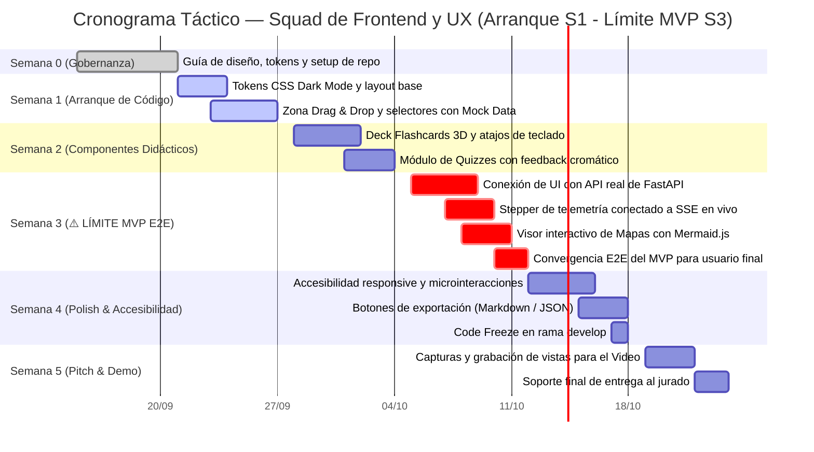

# PLAN OPERATIVO DE TRABAJO — SQUAD DE FRONTEND Y UX
## Proyecto: NuevaMente — Plataforma Educativa Inteligente
**Hackathon:** ONE (Oracle Next Education) & Alura Latam — Cohorte G-10  
**Squad:** Frontend Web & Experiencia de Usuario (UI/UX)  
**Líder de Squad:** Karen Macarena González  

---

## 1. Asignación de Roles e Integrantes del Squad

| Integrante | Rol en el Squad | Responsabilidades Clave |
|---|---|---|
| **Karen Macarena González** | **Frontend Lead & UI/UX Designer** | Dirección de diseño "Minimalismo Clásico Tecnológico", maquetación de vistas, microinteracciones CSS 3D (Flashcards flip), diseño de componentes didácticos y consistencia visual. |
| **Cristian Cortes** | **Frontend Developer & API Integrator** | Gestión del estado del cliente, cliente HTTP (`fetch`/`axios`), conexión con el Mock Endpoint y SSE (`EventSource`), renderizado reactivo de Quizzes y visor Mermaid.js. |

---

## 2. Autonomía y Desacoplamiento Operativo

> [!IMPORTANT]
> **Garantía de Trabajo Inmediato (Sin Bloqueos):**
> El Squad de Frontend cuenta con **autonomía absoluta desde el Día 1 de la Semana 1**:
> 1. **Mock Data Local (`src/frontend/mock/mock_data.js`):** El equipo puede arrancar el desarrollo de los componentes visuales de inmediato utilizando datos estáticos en memoria definidos en la **Sección 3** de este documento.
> 2. **Mock Endpoint de Backend:** A partir de las 48h de la Semana 1, Frontend puede apuntar sus llamadas a:
>    `POST http://localhost:8000/api/v1/adaptar-contenido/mock`
> 3. En la Semana 3/4, el cambio al pipeline real de IA se realiza simplemente cambiando la URL a `/api/v1/adaptar-contenido`. ¡Cero reescritura de interfaz!

---

## 3. Estructuras de Datos JSON y Mocks Canónicos

Para que este documento sea 100% autosuficiente, a continuación se definen los contratos JSON exactos que el Frontend envía y recibe:

### 3.1 Carga Útil Enviada al Backend (Request Payload)
```json
{
  "documento_titulo": "Introducción a Virtual Cloud Networks (VCN)",
  "documento_contenido": "Una Virtual Cloud Network (VCN) en Oracle Cloud Infrastructure es...",
  "perfil_destinatario": "Junior",
  "formato_salida": "Flashcards",
  "nicho_sector": "General",
  "nivel_detalle": "Didactico"
}
```
*Opciones válidas:*
- `perfil_destinatario`: `"Junior"`, `"Senior"`, `"Ejecutivo"`.
- `formato_salida`: `"Flashcards"`, `"Quiz Interactivo"`, `"Mapa Mental"`, `"Guia Paso a Paso"`, `"Resumen Ejecutivo"`.

### 3.2 Respuesta Canónica para Flashcards (`mock_data.js`)
```json
{
  "status": "exito",
  "metadatos": {
    "perfil_aplicado": "Junior",
    "formato_generado": "Flashcards",
    "tiempo_estimado_estudio_minutos": 5,
    "conceptos_clave": ["VCN", "Subred Privada", "Internet Gateway", "Security List"],
    "nicho_contexto": "General"
  },
  "contenido_adaptado": {
    "titulo": "Dominando Oracle VCN para Junior",
    "introduccion_contextualizada": "Imagina la VCN como tu propio barrio privado y seguro en la nube de Oracle.",
    "items": [
      {
        "frente": "¿Qué es una Virtual Cloud Network (VCN)?",
        "dorso": "Es tu red virtual privada y personalizada dentro de la nube de Oracle, funcionando como la infraestructura de red de tu empresa.",
        "pista_didactica": "Piensa en ella como la cerca perimetral donde residen tus servidores.",
        "categoria_dificultad": "Básico"
      },
      {
        "frente": "¿Cuál es la función de una Security List?",
        "dorso": "Actúa como un firewall virtual regulando el tráfico de entrada (ingress) y salida (egress) a nivel de subred.",
        "pista_didactica": "Son las reglas que consulta el guardia de seguridad en la entrada.",
        "categoria_dificultad": "Intermedio"
      }
    ]
  },
  "evaluacion_calidad": {
    "anclaje_fuente_score": 0.98,
    "claridad_pedagogica": "Alta",
    "observaciones": "Respuesta validada y anclada al documento técnico original."
  },
  "almacenamiento_oci": {
    "bucket": "nuevamente-contenidos-educativos",
    "objeto_id": "contenido-vcn-junior-001.json",
    "status_upload": "completado"
  }
}
```

### 3.3 Respuesta Canónica para Quiz Interactivo
```json
{
  "status": "exito",
  "metadatos": {
    "perfil_aplicado": "Senior",
    "formato_generado": "Quiz Interactivo",
    "tiempo_estimado_estudio_minutos": 8,
    "conceptos_clave": ["Overfitting", "Regularización L2", "Data Leakage"],
    "nicho_contexto": "General"
  },
  "contenido_adaptado": {
    "titulo": "Evaluación Técnica: Pipeline de Machine Learning",
    "introduccion_contextualizada": "Cuestionario de alta exigencia sobre prevención de sobreajuste y generalización de modelos.",
    "items": [
      {
        "pregunta": "¿Qué técnica arquitectónica previene directamente el sobreajuste penalizando coeficientes grandes?",
        "opciones": [
          "Aumento arbitrario del learning rate",
          "Regularización L2 (Ridge Penalty)",
          "Eliminación de la fase de validación cruzada",
          "One-Hot Encoding sin límite dimensional"
        ],
        "indice_correcto": 1,
        "justificacion_tecnica": "La regularización L2 añade un término de penalización proporcional al cuadrado de los coeficientes a la función de pérdida.",
        "pista_didactica": "Piensa en la norma euclídea aplicada a los pesos.",
        "explicacion_distractores": "Aumentar el learning rate puede provocar divergencia; eliminar la validación cruzada oculta el sobreajuste."
      }
    ]
  },
  "evaluacion_calidad": {
    "anclaje_fuente_score": 0.95,
    "claridad_pedagogica": "Alta",
    "observaciones": "Pregunta de nivel senior con alta profundidad técnica."
  },
  "almacenamiento_oci": {
    "bucket": "nuevamente-contenidos-educativos",
    "objeto_id": "quiz-ml-senior-001.json",
    "status_upload": "completado"
  }
}
```

### 3.4 Respuesta Canónica para Mapa Mental (Mermaid)
```json
{
  "status": "exito",
  "metadatos": {
    "perfil_aplicado": "Ejecutivo",
    "formato_generado": "Mapa Mental",
    "tiempo_estimado_estudio_minutos": 6,
    "conceptos_clave": ["Gobierno de Datos", "Costos", "Cumplimiento"],
    "nicho_contexto": "Fintech"
  },
  "contenido_adaptado": {
    "titulo": "Árbol Estratégico de Gobernanza de Datos",
    "introduccion_contextualizada": "Visión macro de los pilares de retención, costos y cumplimiento normativo.",
    "items": {
      "nodo_central": "Gobernanza de Datos",
      "descripcion_general": "Esquema jerárquico de políticas de seguridad y costos",
      "ramas_principales": [
        {
          "nombre_rama": "Políticas de Cumplimiento",
          "subnodos": [{"titulo": "Auditorías de Acceso", "detalles": ["Logs inmutables", "Reportes trimestrales"]}]
        },
        {
          "nombre_rama": "Optimización Financiera",
          "subnodos": [{"titulo": "Capa Always Free OCI", "detalles": ["Ahorro de $1200/mes", "Object Storage seguro"]}]
        }
      ],
      "codigo_mermaid": "mindmap\n  root((Gobernanza de Datos))\n    Politicas de Cumplimiento\n      Auditorias de Acceso\n      Logs Inmutables\n    Optimizacion Financiera\n      Capa Always Free OCI\n      Coste Cero Dolar"
    }
  },
  "evaluacion_calidad": {
    "anclaje_fuente_score": 0.96,
    "claridad_pedagogica": "Alta",
    "observaciones": "Estructura conceptual ejecutiva con síntesis de negocio."
  },
  "almacenamiento_oci": {
    "bucket": "nuevamente-contenidos-educativos",
    "objeto_id": "mapa-gobernanza-001.json",
    "status_upload": "completado"
  }
}
```

### 3.5 Eventos de Telemetría en Vivo (Server-Sent Events)
Llegan desde `GET /api/v1/adaptar-contenido/stream/{task_id}` con formato:
```json
{
  "fase_actual": "INDEXACION",
  "fase_numero": 2,
  "porcentaje_progreso": 40,
  "mensaje_descriptivo": "Generando fragmentos semánticos y guardando en ChromaDB...",
  "tiempo_transcurrido_segundos": 1.8
}
```

---

## 4. Estructura de Directorios del Módulo Frontend

```text
src/frontend/
├── index.html                # Plantilla base HTML5 con tipografías Inter y JetBrains Mono
├── styles/
│   ├── main.css              # Tokens de diseño, reseteo, paleta Dark Mode y layout
│   ├── stepper.css           # Animaciones y diseño del Stepper de telemetría en vivo
│   ├── flashcards.css        # Animación 3D de volteo (preserve-3d, rotateY)
│   ├── quiz.css              # Estilos interactivos de preguntas, opciones y feedback
│   └── mindmap.css           # Contenedor para el visor SVG interactivo de Mermaid
├── mock/
│   └── mock_data.js          # Respuestas JSON canónicas (Flashcards, Quiz, Mapa)
├── js/
│   ├── app.js                # Orquestador del ciclo de vida y navegación
│   ├── api_client.js         # Wrapper de peticiones HTTP a la API y conexión SSE
│   ├── components/
│   │   ├── uploader.js       # Drag & Drop de archivos (.pdf, .md, .txt) y lectura local
│   │   ├── profile_selector.js # Selector de perfiles (Junior, Senior, Ejecutivo)
│   │   ├── format_selector.js  # Selector de formatos pedagógicos
│   │   ├── stepper.js        # Componente dinámico de los 5 estados de procesamiento
│   │   ├── flashcard_deck.js # Renderizador de tarjetas 3D con atajos de teclado
│   │   ├── quiz_runner.js    # Evaluador de preguntas con retroalimentación instantánea
│   │   ├── mindmap_canvas.js # Integración con Mermaid.js para mapas conceptuales
│   │   └── quality_badge.js  # Insignia de fidelidad de IA y confirmación de OCI
└── assets/
    ├── icons/                # SVGs para perfiles, formatos y estados
    └── branding/             # Logo de NuevaMente
```

---

## 5. Hoja de Ruta y Timeline de Ejecución (Arranque Semana 1 — Límite MVP Semana 3)

> [!IMPORTANT]
> **Ventana Estratégica de Desarrollo:**
> - **Semana 0 (15 al 20 Septiembre):** Fase Cero de Gobernanza, definición de guía de estilos y tokens de diseño. **Cero líneas de código.**
> - **Semana 1 (21 al 27 Septiembre):** **Arranque oficial de codificación** en Frontend: tokens CSS Dark Mode, zona Drag & Drop y consumo de Mock Data.
> - **Semana 2 (28 Septiembre al 04 Octubre):** Desarrollo interactivo de Flashcards 3D (giro CSS) y Quizzes con retroalimentación instantánea.
> - **Semana 3 (05 al 11 Octubre) — ⚠️ HITO CRÍTICO: LÍMITE DE ENTREGA DEL MVP FUNCIONAL:** Conexión de la UI con la API real de FastAPI, Stepper en tiempo real conectado a SSE y renderizador Mermaid.js para Mapas Mentales.
> - **Semana 4 (12 al 18 Octubre):** Pulido de microinteracciones, accesibilidad de teclado, botones de descarga y Code Freeze.
> - **Semana 5 (19 al 24 Octubre):** Grabación del recorrido de usuario para el Video Pitch oficial y entrega.



### Entregables Clave por Semana del Squad de Frontend & UX:
| Semana | Fechas | Objetivo Principal | Entregable Técnico Verificable |
|---|---|---|---|
| **Semana 0** | 15 - 20 Sep | Organización & Diseño | Guía de tokens de diseño y prototipo wireframe aprobados. |
| **Semana 1** | 21 - 27 Sep | **Arranque de Código** | Maquetación web lista; formulario Drag & Drop interactivo consumiendo datos mock locales. |
| **Semana 2** | 28 Sep - 04 Oct | Tarjetas y Quizzes | Deck de Flashcards 3D volteando con [Espacio]; Quizzes evaluando respuestas y mostrando justificación técnica. |
| **Semana 3** | **05 - 11 Oct** | **⚠️ HITO LÍMITE MVP** | **Frontend E2E 100% interactivo:** Conectado a la API real, Stepper animándose vía SSE y Mapa Mental Mermaid navegable. |
| **Semana 4** | 12 - 18 Oct | Polish & Descargas | Experiencia refinada con transiciones suaves y exportador de resúmenes. Code Freeze. |
| **Semana 5** | 19 - 24 Oct | Video Pitch & Cierre | Material audiovisual grabado mostrando la experiencia de usuario para el pitch. |

---

## 6. Implementación Técnica de los Componentes Clave

### 6.1 Sistema de Diseño: Tokens CSS ("Minimalismo Clásico Tecnológico")

```css
:root {
  /* Paleta de Color */
  --bg-primary: #0F172A;       /* Slate 900 - Fondo profundo */
  --bg-surface: #1E293B;       /* Slate 800 - Superficies y tarjetas */
  --bg-surface-hover: #334155; /* Slate 700 - Hover sutil */
  --border-subtle: #334155;    /* Bordes limpios */
  --border-focus: #38BDF8;     /* Sky 400 - Foco y acento primario */
  
  --text-primary: #F8FAFC;     /* Slate 50 - Texto principal */
  --text-secondary: #94A3B8;   /* Slate 400 - Etiquetas y metadatos */
  --text-muted: #64748B;       /* Slate 500 - Pistas y ayuda */

  --accent-primary: #38BDF8;   /* Sky 400 */
  --accent-secondary: #6366F1; /* Indigo 500 */
  --color-success: #10B981;    /* Emerald 500 - Respuestas correctas / OCI badge */
  --color-error: #EF4444;      /* Rose 500 - Errores de quiz */
  --color-warning: #F59E0B;    /* Amber 500 - Alertas didácticas */

  /* Tipografía */
  --font-main: 'Inter', system-ui, -apple-system, sans-serif;
  --font-mono: 'JetBrains Mono', monospace;

  /* Elevaciones */
  --shadow-card: 0 4px 6px -1px rgba(0, 0, 0, 0.3), 0 2px 4px -2px rgba(0, 0, 0, 0.3);
  --shadow-active: 0 10px 15px -3px rgba(56, 189, 248, 0.2);
}
```

---

### 6.2 Componente Flashcards 3D (`src/frontend/components/flashcard_deck.js`)

```javascript
export class FlashcardDeck {
  constructor(containerId, items) {
    this.container = document.getElementById(containerId);
    this.items = items;
    this.currentIndex = 0;
    this.isFlipped = false;
    this.init();
  }

  init() {
    this.render();
    this.bindEvents();
  }

  render() {
    const card = this.items[this.currentIndex];
    this.container.innerHTML = `
      <div class="flashcard-wrapper">
        <div class="flashcard-progress">
          <span>Tarjeta ${this.currentIndex + 1} de ${this.items.length}</span>
          <span class="badge-dificultad">${card.categoria_dificultad || 'Intermedio'}</span>
        </div>

        <div class="flashcard-scene" id="flashcard-scene">
          <div class="flashcard-card ${this.isFlipped ? 'flipped' : ''}" id="flashcard-card">
            <!-- Frente -->
            <div class="flashcard-face flashcard-front">
              <div class="face-tag">CONCEPTO CLAVE</div>
              <h3 class="face-title">${card.frente}</h3>
              <p class="click-hint">Haz clic o presiona [Espacio] para voltear</p>
            </div>
            <!-- Dorso -->
            <div class="flashcard-face flashcard-back">
              <div class="face-tag">EXPLICACIÓN PEDAGÓGICA</div>
              <p class="face-content">${card.dorso}</p>
              ${card.pista_didactica ? `
                <div class="didactic-tip">
                  <strong>Pista didáctica:</strong> ${card.pista_didactica}
                </div>
              ` : ''}
            </div>
          </div>
        </div>

        <div class="flashcard-controls">
          <button id="btn-prev" class="btn-secondary" ${this.currentIndex === 0 ? 'disabled' : ''}>← Anterior</button>
          <button id="btn-flip" class="btn-primary">Voltear Tarjeta</button>
          <button id="btn-next" class="btn-secondary" ${this.currentIndex === this.items.length - 1 ? 'disabled' : ''}>Siguiente →</button>
        </div>
      </div>
    `;
  }

  bindEvents() {
    const cardElement = document.getElementById('flashcard-card');
    const btnFlip = document.getElementById('btn-flip');
    const btnPrev = document.getElementById('btn-prev');
    const btnNext = document.getElementById('btn-next');

    const toggleFlip = () => {
      this.isFlipped = !this.isFlipped;
      cardElement.classList.toggle('flipped', this.isFlipped);
    };

    cardElement.addEventListener('click', toggleFlip);
    btnFlip.addEventListener('click', toggleFlip);

    btnPrev.addEventListener('click', () => {
      if (this.currentIndex > 0) {
        this.currentIndex--;
        this.isFlipped = false;
        this.render();
        this.bindEvents();
      }
    });

    btnNext.addEventListener('click', () => {
      if (this.currentIndex < this.items.length - 1) {
        this.currentIndex++;
        this.isFlipped = false;
        this.render();
        this.bindEvents();
      }
    });

    // Atajos de teclado accesibles
    window.onkeydown = (e) => {
      if (e.code === 'Space') {
        e.preventDefault();
        toggleFlip();
      } else if (e.code === 'ArrowRight' && this.currentIndex < this.items.length - 1) {
        btnNext.click();
      } else if (e.code === 'ArrowLeft' && this.currentIndex > 0) {
        btnPrev.click();
      }
    };
  }
}
```

```css
/* Efecto de Giro 3D */
.flashcard-scene {
  perspective: 1000px;
  width: 100%;
  max-width: 600px;
  height: 340px;
  margin: 1.5rem auto;
}

.flashcard-card {
  width: 100%;
  height: 100%;
  position: relative;
  transform-style: preserve-3d;
  transition: transform 0.6s cubic-bezier(0.4, 0, 0.2, 1);
  cursor: pointer;
}

.flashcard-card.flipped {
  transform: rotateY(180deg);
}

.flashcard-face {
  position: absolute;
  width: 100%;
  height: 100%;
  backface-visibility: hidden;
  border-radius: 12px;
  padding: 2rem;
  box-sizing: border-box;
  background: var(--bg-surface);
  border: 1px solid var(--border-subtle);
  display: flex;
  flex-direction: column;
  justify-content: center;
}

.flashcard-back {
  transform: rotateY(180deg);
  background: #162032;
  border-color: var(--accent-primary);
}
```

---

### 6.3 Componente Quiz con Feedback Inmediato (`src/frontend/components/quiz_runner.js`)

```javascript
export class QuizRunner {
  constructor(containerId, quizItems) {
    this.container = document.getElementById(containerId);
    this.quizItems = quizItems;
    this.answersState = {};
    this.init();
  }

  init() {
    this.render();
  }

  render() {
    this.container.innerHTML = `
      <div class="quiz-container">
        <h2 class="quiz-header">Quiz de Evaluación Técnica</h2>
        ${this.quizItems.map((item, qIdx) => `
          <div class="quiz-card" id="quiz-question-${qIdx}">
            <div class="quiz-question-number">Pregunta ${qIdx + 1} de ${this.quizItems.length}</div>
            <p class="quiz-question-text">${item.pregunta}</p>
            <div class="quiz-options">
              ${item.opciones.map((opc, oIdx) => `
                <button class="quiz-option-btn" 
                        data-question="${qIdx}" 
                        data-option="${oIdx}">
                  <span class="option-letter">${String.fromCharCode(65 + oIdx)}</span>
                  <span class="option-text">${opc}</span>
                </button>
              `).join('')}
            </div>
            <div class="quiz-feedback-box hidden" id="feedback-${qIdx}"></div>
          </div>
        `).join('')}
      </div>
    `;

    this.bindOptions();
  }

  bindOptions() {
    const buttons = this.container.querySelectorAll('.quiz-option-btn');
    buttons.forEach(btn => {
      btn.addEventListener('click', (e) => {
        const targetBtn = e.currentTarget;
        const qIdx = parseInt(targetBtn.getAttribute('data-question'), 10);
        const oIdx = parseInt(targetBtn.getAttribute('data-option'), 10);

        if (this.answersState[qIdx] !== undefined) return; // Bloquear si ya respondió

        this.answersState[qIdx] = oIdx;
        const item = this.quizItems[qIdx];
        const isCorrect = (oIdx === item.indice_correcto);

        const questionCard = document.getElementById(`quiz-question-${qIdx}`);
        const siblings = questionCard.querySelectorAll('.quiz-option-btn');
        siblings.forEach((sBtn, idx) => {
          sBtn.disabled = true;
          if (idx === item.indice_correcto) {
            sBtn.classList.add('correct');
          } else if (idx === oIdx && !isCorrect) {
            sBtn.classList.add('incorrect');
          }
        });

        const feedbackBox = document.getElementById(`feedback-${qIdx}`);
        feedbackBox.classList.remove('hidden');
        feedbackBox.innerHTML = `
          <div class="feedback-banner ${isCorrect ? 'banner-correct' : 'banner-incorrect'}">
            ${isCorrect ? '✓ ¡Respuesta Correcta!' : '✗ Respuesta Incorrecta'}
          </div>
          <div class="feedback-justification">
            <strong>Justificación Técnica:</strong> ${item.justificacion_tecnica}
          </div>
          ${item.explicacion_distractores ? `
            <div class="feedback-distractors">
              <strong>Análisis de Opciones:</strong> ${item.explicacion_distractores}
            </div>
          ` : ''}
        `;
      });
    });
  }
}
```

---

### 6.4 Visor de Mapas Mentales con Mermaid.js (`src/frontend/components/mindmap_canvas.js`)

```javascript
import mermaid from 'mermaid';

mermaid.initialize({
  startOnLoad: false,
  theme: 'dark',
  themeVariables: {
    darkMode: true,
    background: '#1E293B',
    primaryColor: '#38BDF8',
    primaryTextColor: '#F8FAFC',
    lineColor: '#64748B'
  }
});

export class MindmapCanvas {
  constructor(containerId, mermaidCode) {
    this.container = document.getElementById(containerId);
    this.mermaidCode = mermaidCode;
    this.init();
  }

  async init() {
    this.container.innerHTML = `
      <div class="mindmap-toolbar">
        <button id="btn-zoom-in" class="btn-tool">Zoom +</button>
        <button id="btn-zoom-out" class="btn-tool">Zoom -</button>
        <button id="btn-fullscreen" class="btn-tool">Pantalla Completa</button>
      </div>
      <div class="mermaid-render-area" id="mermaid-svg-container">
        <div class="mermaid">${this.mermaidCode}</div>
      </div>
    `;
    await mermaid.run({ nodes: [this.container.querySelector('.mermaid')] });
  }
}
```

---

### 6.5 Stepper de Telemetría Dinámico en Vivo (SSE) (`src/frontend/components/stepper.js`)

Muestra las 5 etapas del pipeline en tiempo real conforme llegan eventos desde el backend:
1. `EXTRACCION` (20%) — *"Procesando documento con PyMuPDF..."*
2. `INDEXACION` (40%) — *"Generando embeddings y guardando en ChromaDB..."*
3. `GENERACION` (60%) — *"Agentes creando contenido para perfil seleccionado..."*
4. `AUDITORIA` (80%) — *"Agente Crítico evaluando anclaje semántico (Meta: $\ge 0.85$)..."*
5. `PERSISTENCIA` (100%) — *"Persistido en OCI Object Storage Always Free."*

---

## 7. Definición de Terminado (Definition of Done - DoD)
- [ ] Interfaz completamente funcional y responsiva en escritorio y tabletas.
- [ ] Zona de carga Drag & Drop operativa con soporte para `.pdf`, `.md` y `.txt`.
- [ ] Selector de Perfil y Formato conectado correctamente al payload de envío.
- [ ] Flashcards 3D voltean fluidamente con soporte de teclado ([Espacio] y [Flechas]).
- [ ] Quizzes ofrecen retroalimentación cromática inmediata y despliegan la justificación técnica.
- [ ] Mapa Mental se dibuja con Mermaid.js sin cortes visuales.
- [ ] Stepper de telemetría refleja los eventos SSE de backend sin retrasos.
- [ ] Insignia de fidelidad (`anclaje_fuente_score`) e insignia de persistencia OCI visibles en el encabezado del resultado.
