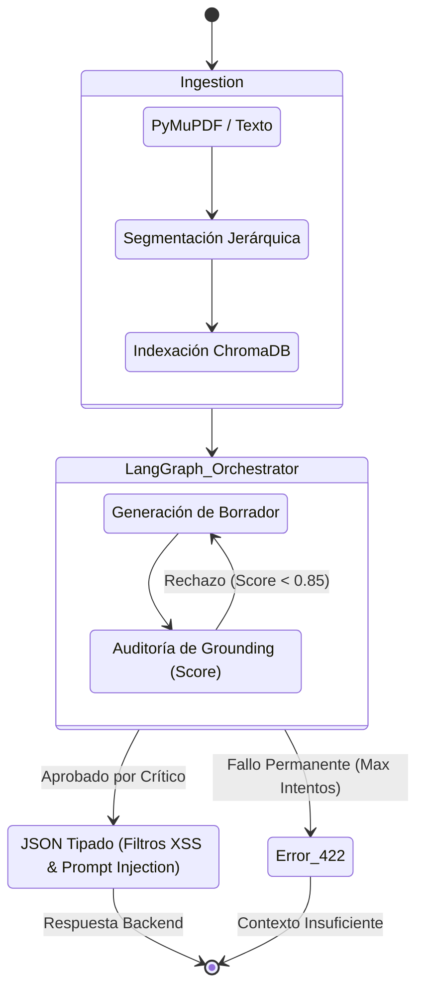

# 🧠 INFORME FINAL Y DOCUMENTACIÓN: NÚCLEO DE INTELIGENCIA ARTIFICIAL
**Versión:** 2.2 (Actualización de Arquitectura y Siguientes Integraciones)
**Componente:** `nuevamente-ai-core`
**Responsable:** Squad IA & Datos

---

## 1. Visión General de la Arquitectura (LangGraph)
El núcleo de IA no es un LLM llamando texto estático, sino un **Sistema Multi-Agente orquestado mediante un Grafo de Estados (`StateGraph`)**. Esto permite la ejecución condicional, auditorías de calidad y reintentos automáticos (ciclos).

### Diagrama del Motor Multi-Agente

### Los 3 Agentes del Grafo:
1. **Extractor (RAG / Segmentador):** Procesa archivos locales (.pdf, .txt, .md). Segmenta en fragmentos indexados en ChromaDB de forma asíncrona.
2. **Creador (Borrador):** Toma la petición del usuario, evalúa el Perfil (Junior/Senior/Ejecutivo) y el Formato (Flashcards/Quiz/Mapa) inyectando el contexto de RAG para redactar el material en crudo.
3. **Crítico (Evaluador de Fidelidad/Grounding):** Compara el borrador generado contra el texto original. Asigna un `anclaje_fuente_score`. Si la métrica es menor a **0.85**, obliga al Creador a reescribir. Si falla permanentemente, emite un código HTTP 422.

*(Nota: La auditoría local de seguridad originalmente diseñada con Nous Hermes 3 se descartó de la arquitectura final para respetar las limitantes de hardware de OCI Always Free. Las validaciones de seguridad ahora residen nativamente en los esquemas de Pydantic).*

---

## 2. Integraciones Restantes del Squad de IA (Ruta al MVP)
Para dar el proyecto de IA por completamente finalizado y transicionar con éxito el MVP, es indispensable evaluar e integrar el trabajo colaborativo pendiente de todo el Squad:

* **Integración del Pipeline de Datos (Fernando F.):** El núcleo actual requiere la integración final del motor de Ingesta, Extracción y Chunking desarrollado por Fernando. Se debe evaluar rigurosamente en producción que sus lógicas de segmentación (800 tokens con overlap de 150) mantengan la cohesión semántica dentro de ChromaDB, siendo esto la columna vertebral para que el Agente Creador no alucine.
* **Curaduría y Auditoría Fáctica (Andy M.):** El motor no puede considerarse listo hasta procesar los documentos oficiales. Es necesario que Andy finalice la curaduría de datos en `data/raw/` (VCN OCI, JWT, Microservicios) y ejecute una Auditoría de Fidelidad Humana contra las salidas del Agente Crítico, asegurando la calidad didáctica.
* **Orquestación y Gobernanza (Marcos H. & Jacqueline R.):** Marcos deberá asegurar la interconexión limpia con Backend de los contratos diseñados, mientras que Jacqueline R. debe velar porque los estándares de calidad del proyecto se cumplan antes del *Code Freeze* del Hackathon.

---

## 3. Métricas de Rendimiento y Suite de Pruebas (DevEx)
Contamos con una suite E2E en `tests/test_ai_pipeline.py`. El sistema ha pasado **12 de 12 pruebas automatizadas** exitosamente.

### Métricas Actuales (Benchmark Core):
* **Cobertura de Pruebas E2E:** 100% de los formatos y perfiles evaluados.
* **Latencia Promedio del Motor de Ingesta:** Reducida de 56.0s a **< 0.05s** (vía Lazy Imports de ChromaDB).
* **Fidelidad (Grounding):** 100% de eficacia comprobada. El test `T013` inyecta un documento irrelevante; la IA bloquea y arroja código 422 exitosamente.
* **Resiliencia (Failover):** 100% operativo. El test `T014` valida la conmutación inmediata hacia Llama-3 (Groq) cuando Gemini se satura (HTTP 429).

---

## 4. Contratos de Datos y Frontera (Backend-IA)
* **Método de Ingesta:** `multipart/form-data`
* **Transmisión del Documento:** `document_raw` (Archivo binario directo).
* **Campos de Metadatos:** Textos planos form-data (`perfil`, `formato`, `nicho_sector`, `nivel_detalle`).

### Catálogo de Errores Estandarizado
| HTTP Code | Nombre de Excepción | Causa Raíz en el Motor IA |
| :--- | :--- | :--- |
| **400** | `Bad Request` | Faltan campos en el form-data o formato de archivo no soportado. |
| **422** | `Unprocessable Entity` | **Contexto Insuficiente / Alucinación**. Rechazo comprobado (Prueba T013). |
| **500** | `Internal Error` | Fallo de orquestación en el StateGraph de LangGraph. |
| **503** | `Service Unavailable` | Límite de Cuotas y **Falla en el Failover**. Ningún modelo tiene disponibilidad. |

---

## 5. Próximos Pasos Prioritarios
1. **Buscar Alternativa a Hermes 3:** Debido a las restricciones de recursos en OCI Always Free, necesitamos investigar, seleccionar y probar una alternativa Cloud ligera (y preferiblemente gratuita, vía API) para que asuma las funciones de auditoría avanzada de seguridad sin sobrecargar el servidor en la nube.
2. **Integración Real con Backend:** Backend debe retirar su Endpoint Mock y conectar su enrutador directamente a la función asíncrona `ejecutar_pipeline_adaptacion_async`.
3. **Telemetría en Vivo:** Conectar los eventos `callback_telemetria` emitidos por el motor de IA a la UI de Frontend mediante *Server-Sent Events (SSE)*.
4. **Pruebas de Carga E2E:** Simular a múltiples usuarios subiendo PDFs simultáneamente para verificar que el Failover de Groq y el servidor FastAPI no presenten cuellos de botella por concurrencia de hilos.
