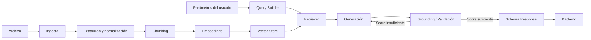

# ARQ-02 — Matriz de Alcance y Definición del MVP

**Proyecto:** NuevaMente  
**Squad:** IA / Data  
**Estado:** Alineación documental propuesta para MVP  
**Fecha:** 26-09-2026

## 1. Objetivo

Definir el alcance funcional y técnico de IA/Data para el MVP y establecer una fuente única de verdad para la integración con Backend.

## 2. Flujo objetivo



## 3. Incluido en MVP

- Ingesta de documentos soportados por el contrato.
- Extracción y normalización del contenido.
- Chunking con estrategia documentada.
- Generación de embeddings.
- Persistencia en vector store.
- Recuperación semántica condicionada por el formato solicitado.
- Query Builder orientado al objetivo pedagógico.
- Generación mediante LLM.
- Aplicación del perfil y nicho/sector.
- Validación de fidelidad mediante grounding.
- Respuesta estructurada mediante schema.
- Manejo explícito de contexto insuficiente.
- Integración Backend ↔ IA.

## 4. Perfiles MVP

1. Principiante / Junior
2. Líder Técnico
3. Ejecutivo

## 5. Formatos MVP

1. Flashcards
2. Quiz Interactivo
3. Resumen Ejecutivo
4. **Mapa Mental**

> **Guía Paso a Paso** queda como extensión posterior y no forma parte del alcance funcional del MVP actual.

## 6. Temas técnicos alineados

| Tema | Decisión MVP |
|---|---|
| Contrato archivo ↔ IA | Backend entrega documento original + parámetros; IA valida, detecta formato, extrae y normaliza |
| Contrato JSON | Definido |
| Embeddings | Parte del pipeline |
| RAG | Retriever + Query Builder |
| LLM + prompts | Generación condicionada por perfil/formato/nicho |
| Orquestación | Debe mantenerse explícita y trazable |
| Grounding | Validación obligatoria |
| Contexto insuficiente | Debe tener comportamiento definido |
| Schema | Validación antes de entregar respuesta |

## 7. Regla de cierre

Un punto técnico se considera **CERRADO** cuando existe:

- decisión documentada;
- implementación verificable;
- prueba o evidencia asociada.

Si solo existe la decisión documental, el estado correcto es **DECIDIDO / PENDIENTE DE VALIDACIÓN**.

## 8. Fuera del MVP

No forman parte del cierre mínimo:

- GraphRAG;
- Semantic Splitter avanzado;
- **Guía Paso a Paso**;
- formatos adicionales no aprobados;
- optimizaciones prematuras de arquitectura;
- telemetría avanzada no requerida para la integración;
- capacidades experimentales sin criterio de aceptación.

## 9. Trazabilidad

### Frontera de entrada Backend ↔ IA

```
Backend
  │
  ├── documento original
  └── parámetros
        │
        ▼
      Data / IA
        │
        ├── validación inicial
        ├── detección de formato
        ├── extracción
        └── normalización
```

Formatos inicialmente soportados por IA: **PDF, DOCX, Markdown y TXT**.

Este documento consolida las decisiones derivadas de los análisis GAP-01 a GAP-08 y debe mantenerse sincronizado con los issues IA correspondientes.
