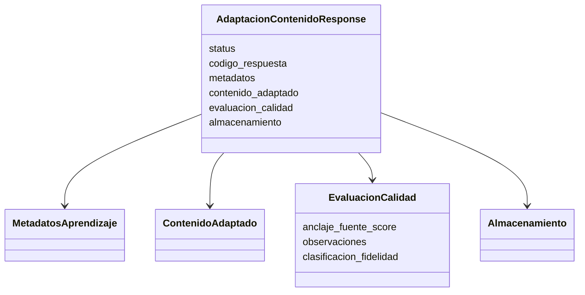

# Schema de Response — MVP

## 1. Objetivo

Definir la estructura conceptual de la respuesta que IA entrega al Backend.

## 2. Estructura

## 3. Campos mínimos

### Response

- `status`
- `codigo_respuesta`
- `metadatos`
- `contenido_adaptado`
- `evaluacion_calidad`

### Evaluación

- `anclaje_fuente_score`
- `observaciones`
- clasificación de fidelidad, si está implementada.

## 4. Validación

La respuesta debe pasar validación estructural antes de considerarse exitosa.

Casos mínimos:

| Caso | Resultado esperado |
|---|---|
| Schema válido | respuesta exitosa |
| Campo requerido ausente | error de validación |
| Enum inválido | error de validación |
| Contenido insuficiente | respuesta controlada |
| Grounding bajo | corrección o respuesta limitada |
| Error interno | código de error controlado |

## 5. Compatibilidad

El schema es contrato de integración, no detalle interno de implementación.

Los equipos pueden cambiar sus componentes internos siempre que mantengan el contrato versionado.
