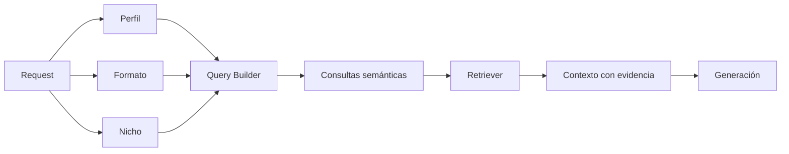

# Estrategia RAG — MVP

## 1. Objetivo

Definir cómo NuevaMente recupera contexto relevante para generar contenido adaptado sin depender de similitud semántica genérica.

## 2. Principio

El RAG debe responder a la intención del formato solicitado.



## 3. Query Builder

El Query Builder debe producir consultas relacionadas con el propósito pedagógico.

No se recomienda:

```
request -> embedding(request) -> top-k genérico
```

Se busca:

```
perfil + formato + nicho + objetivo
        ↓
consultas orientadas
        ↓
retrieval
        ↓
contexto verificable
```

## 4. Contexto recuperado

Cada fragmento recuperado debe conservar:

- identificador del documento;
- identificador del chunk;
- contenido;
- metadata de origen;
- relevancia;
- información necesaria para citar o auditar.

## 5. Umbrales

Los umbrales de similitud y cantidad de resultados deben ser parámetros configurables y documentados junto con la implementación.

No se considera válido copiar un valor de referencia sin evidencia de que funciona con el dataset real del MVP.

## 6. Contexto insuficiente

Si el Retriever no encuentra evidencia suficiente:

1. no debe inventarse información;
2. debe reducirse o limitarse la respuesta;
3. debe registrarse la insuficiencia;
4. el comportamiento final debe respetar el contrato de respuesta.

La política detallada se mantiene en el documento de GAP-05.

## 7. Fuera del MVP

- GraphRAG.
- Recuperación jerárquica avanzada.
- Semantic Splitter avanzado.
- Re-ranking complejo sin necesidad demostrada.

Estas alternativas pueden evaluarse posteriormente mediante experimentación.
