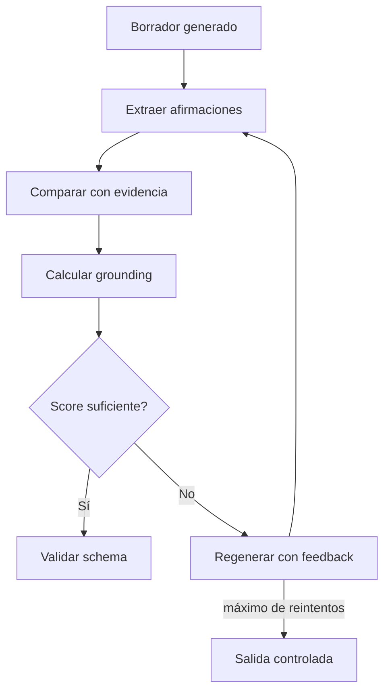

# Grounding y Validación de Fidelidad — MVP

## 1. Objetivo

Evitar que el sistema presente como conocimiento del documento información que no esté respaldada por el contexto recuperado.

## 2. Flujo

## 3. Principios

- El score no debe ser un valor aleatorio.
- La evaluación debe utilizar los fragmentos recuperados como evidencia.
- Debe existir una explicación o evidencia suficiente para auditar el resultado.
- Un score alto no sustituye la validación estructural del schema.
- Un score bajo no debe resolverse inventando contexto.

## 4. Reintentos

El número máximo de reintentos debe ser configurable y formar parte de la política del pipeline.

Cuando se alcanza el máximo:

- no se debe entrar en un ciclo infinito;
- debe emitirse una salida controlada;
- deben registrarse observaciones.

## 5. Criterio de cierre técnico

Grounding puede marcarse como **implementado** únicamente cuando exista:

1. cálculo real del score;
2. evidencia de los fragmentos evaluados;
3. comportamiento de corrección;
4. prueba automatizada o evidencia reproducible.

La documentación por sí sola no demuestra implementación.

## 6. Relación con contexto insuficiente

Grounding y recuperación insuficiente son problemas relacionados pero distintos:

- **Contexto insuficiente:** no existe evidencia adecuada para generar.
- **Grounding bajo:** existe contexto, pero la respuesta generada no está suficientemente respaldada.

Ambos deben tener comportamiento explícito.
