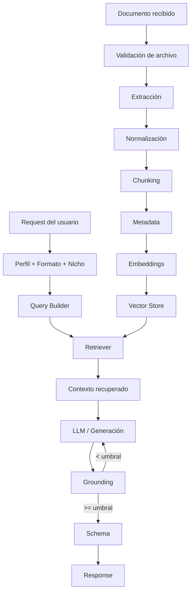

# Pipeline de IA — MVP

## 1. Objetivo

Documentar el flujo técnico de IA desde la recepción del documento hasta la entrega de una respuesta estructurada al Backend.

## 2. Pipeline

## 3. Responsabilidad de cada etapa

### 3.1 Validación de archivo
Verifica que el archivo cumpla el contrato antes de procesarlo.

### 3.2 Extracción y normalización
Convierte el documento a una representación textual consistente y conserva metadata útil para trazabilidad.

### 3.3 Chunking
Divide el contenido en fragmentos recuperables sin perder el contexto necesario para responder.

La configuración concreta del chunking debe mantenerse como decisión técnica versionada; no debe asumirse como definitiva solo por aparecer en documentación de referencia.

### 3.4 Metadata
Cada fragmento debe conservar, como mínimo, información que permita identificar su documento y origen.

Metadata pedagógica adicional puede incluir:

- concepto;
- tipo de contenido;
- dificultad;
- prerrequisitos;
- sección/página cuando corresponda.

### 3.5 Embeddings y Vector Store
Los fragmentos se transforman en vectores y se almacenan para recuperación semántica.

La implementación debe documentar:

- proveedor/modelo de embeddings;
- dimensión;
- métrica;
- estrategia de persistencia;
- fallback, si existe.

### 3.6 Query Builder
No se debe ejecutar una búsqueda semántica genérica.

El Query Builder transforma los parámetros del usuario en consultas orientadas al propósito del formato.

Ejemplo:

| Formato | Intención de recuperación |
|---|---|
| Flashcards | definiciones, conceptos, relaciones clave |
| Quiz | conceptos evaluables, diferencias, reglas |
| Resumen Ejecutivo | objetivos, hallazgos, decisiones, conclusiones |

### 3.7 Retriever
Recupera los fragmentos más relevantes y construye el contexto que recibirá el generador.

Debe conservar referencias a los fragmentos utilizados.

### 3.8 Generación
El LLM recibe:

- objetivo;
- perfil;
- formato;
- nicho/sector;
- contexto recuperado;
- reglas de fidelidad;
- schema esperado.

### 3.9 Grounding
La salida generada se contrasta con el contexto recuperado.

El resultado debe ser auditable y explicar, al menos, si las afirmaciones relevantes tienen soporte suficiente.

### 3.10 Schema
La respuesta final debe validarse antes de entregarse al Backend.

## 4. Criterios de aceptación

- Ninguna etapa crítica queda implícita.
- El Retriever conserva evidencia del contexto usado.
- El generador recibe los parámetros funcionales del request.
- Grounding ocurre antes de la respuesta final.
- Una respuesta inválida no se entrega como válida.
- Las decisiones pendientes están identificadas como tales.
